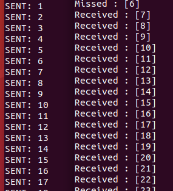
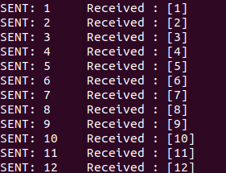
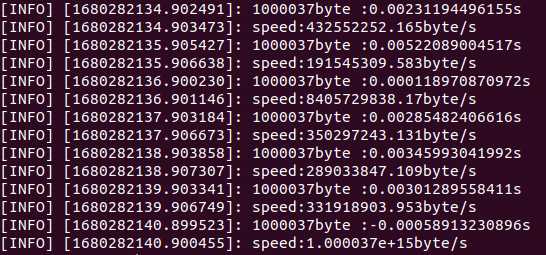
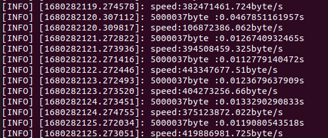
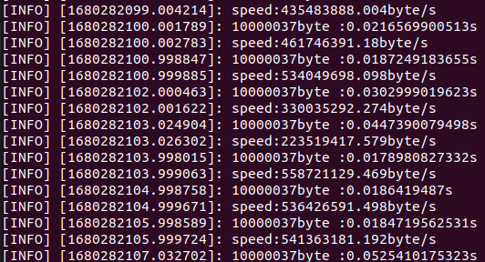
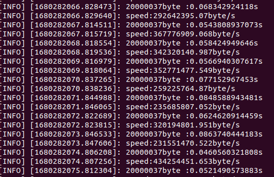
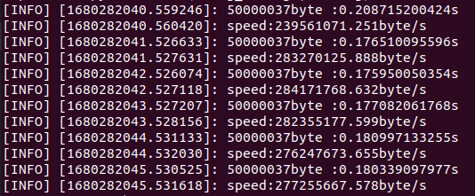

# 230329 - ROS 노드 실습
## Q1) 누락 없이 데이터가 모두 잘 도착하는가?
---
0. 과제설명
- rosrun을 통하여 pub -> sub python 파일을 순차적으로 실행시켰을 경우

1. 현상확인

- 아래 그림과 같이 초기 데이터의 누락 발생


2. 원인분석
- subscriber가 준비되어있지 않은 상태에서 데이터를 먼저 전송했기 떄문이다.

3. 해결책 적용결과 정리
- get_num_connections() [Documents](http://docs.ros.org/en/lunar/api/rospy/html/rospy.topics.Topic-class.html#get_num_connections)
- Method : To check Subscriber connectiton 
```python
while ( pub.get_num_connections() == 0):
    cnt += 1

while not rospy.is_shutdown():
    ...
```


## Q2) 데이터 크기에 따른 전송속도는 어떻게 되는가?
0. 과제설명
1) sender
- sender_speed.py -> receiver_spped.py : sr_speed.launch
- sender 노드 생성 -> Topic : long_string (#으로 가득채움) -> 초당 1회 다양한 용량의 long_string 생성 
- 사이즈를 바꾸어서 1Mbyte, 5Mbyte, 10Mbyte, 20Mbyte, 50Mbyte 전송
2) receiver
- receiver 라는 이름으로 노드생성
- 다양한 용량의 long string을 수신해서, long_string 1개를 다 받으면 소요시간을 화면에 출력함 
- 가능한 속도도 출력하기 단위는 bps(byte/second)

1. 현상확인을 위한 코드 구현
#### sender_speed.py
```python
#!/usr/bin/env python
#-*- coding: utf-8-*-

import rospy 
from std_msgs.msg import String

rospy.init_node('sender', anonymous=True)

pub = rospy.Publisher('long_string', String) 
size = rospy.get_param('~size')
hash = '#'* 1000000 * size#size_dic[size]


rate = rospy.Rate(1) #초당 1회

while not rospy.is_shutdown():
    print size 

    hash_time = hash + ":" + str(rospy.get_time())
    print hash_time
    pub.publish(hash_time) 
    rate.sleep() 
```
#### receiver_speed.py
```python
#!/usr/bin/env python
#-*- coding: utf-8-*-
# Sheband(#!)
import sys
import rospy # rospy module
from std_msgs.msg import String

name = 'receiver'
sub_topic = 'long_string'

def callback(data):
    msgs = data.data.split(":")
    time_data = float(rospy.get_time()) - float(msgs[1])
    str_size = sys.getsizeof(msgs[0])
    rospy.loginfo(str(str_size)+"byte :"+str(time_data)+"s")
    rospy.loginfo("speed:"+str(float(str_size)/max(time_data, 1e-9))+"byte/s")
    
rospy.init_node(name, anonymous=True) 
sub = rospy.Subscriber(sub_topic, String, callback) 

rospy.spin() 

```
#### sr.launch
```python
<launch>
    <arg name="size_m" default="1"/>
	<node pkg="msg_send" type="sender_speed.py" name="sender">
        <param name="size" type="int" value="$(arg size_m)"/>
    </node>
	<node pkg="msg_send" type="receiver_speed.py" name="receiver" output="screen"/>
</launch>
```

2. 결과







3. 분석
- 1M : 0.005s 이하 
- 5M : 0.04s 
- 10M : 0.05s 
- 20M : 0.06s 
- 50M : 0.2s 
- 용량이 커지게 되면 도착시간에 차이는 있으나 속도에는 큰차이가 없는 것을 확인함 

## Q3) 도착하는 데이터를 미처 처리하지 못하면 어떻게 되는가?
0. 과제설명
1. 현상확인을 위한 코드 구현
2. 원인분석
3. 해결책 적용결과 정리


## Q4) 주기적 발송에서 타임슬롯을 오버하면 어떻게 되는가?
1. 현상확인
2. 원인분석
3. 해결책 적용결과 정리

## Q5) 협업 상황에서 노드를 순서대로 기동할 수 있는가?
1. 현상확인
2. 원인분석
3. 해결책 적용결과 정리


