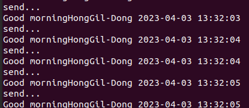

# 230329 - 실습 2 받은 통신 가공해서 보내기

- teacher (sub) <-msg_to_xycar<-student(pub)
- remote_teacher.py , remote_student.py, remote.launch
- topic name : msg_to_xycar(my_msg) , msg_from_xycar(String)

- remote_student.py : 자신의 인적사항을 전송함 , msg_to_xycar를 통해서 teacher에서 온 msg_from xycar화면에 출력
- remote_teacher.py : msg_to_xycar 토픽에서 학생의 이름만 뽑아내서 "good morning 학생이름 현재시간" 이라는 srting으로 msg_from_xycar 토픽 생성 전송

- remote.launch
```python
<launch>
	<node pkg="msg_send" type="remote_teacher.py" name="teacher" output="screen"/>
	<node pkg="msg_send" type="remote_student.py" name="student" output="screen"/>
</launch>

```
- remote_sutdent.py
```python
#!/usr/bin/env python
#-*- coding: utf-8-*-

import rospy 
from std_msgs.msg import String
from msg_send.msg import my_msg

done = False
def callback(msg): # callback 함수 정의
    print msg.data # msg.data 출력
    done = True

rospy.init_node('remote_student', anonymous=True)
pub = rospy.Publisher('msg_to_xycar', my_msg)
rospy.Subscriber('msg_from_xycar', String, callback)
rate = rospy.Rate(2) 

msg = my_msg()
msg.first_name = "Gil-Dong"
msg.last_name = "Hong"
msg.age = 15
msg.score = 100
msg.id_number = 12345678
msg.phone_number = "010-0000-0000"


while not rospy.is_shutdown() and not done: 
    pub.publish(msg)
    print 'send...' 
    rate.sleep() 
```
- remote_teacher.py
```python
#!/usr/bin/env python
#-*- coding: utf-8-*-
# Sheband(#!)

import rospy # rospy module
from std_msgs.msg import String
from msg_send.msg import my_msg
import time


def callback(msg):
    st_name = msg.last_name + '' + msg.first_name
    curr_time = time.strftime('%Y-%m-%d %H:%M:%S', time.localtime())
    st_name2 = 'Good morning'+ st_name + ' ' + curr_time
    pub.publish(st_name2)
    
rospy.init_node('remote_teacher', anonymous=True)
pub = rospy.Publisher('msg_from_xycar',String,queue_size=1)
sub = rospy.Subscriber('msg_to_xycar', my_msg, callback) 


rospy.spin()
```


