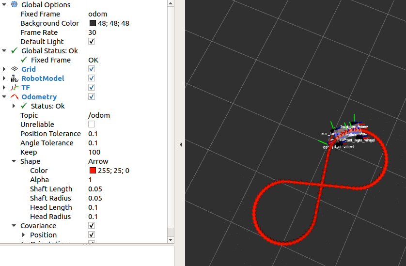

# [과제 1] 모터제어기 프로그래밍

### 목표 : 자이카 8자 주행

- 차량속도는 고정시키고 핸들만 조종해보자(천천히 주행)


## 1. 패키지 생성 & 파일 생성

```
$ catkin_create_pkg my_motor std_msgs rospy
```

```
$ mkdir ~/xycar_ws/src/my_motor/launch
$ gedit 8_drive.launch
$ cd ./src/
$ gedit 8_drive.py
```

## 2. Launch 파일 내에 8_drive.launch 파일 만들기

```xml
<!--- ~/xycar_ws/src/my_motor/launch/8_drive.launch-->
<launch>
    <!---motor node-->
    <include file = "$(find xycar_motor)/launch/xycar_motor.launch"/>

    <!---auto driver -->
    <node name="auto_driver" pkg="my_motor" type="8_drive.py" output="screen">
</launch>

```

## 3. src 폴더에 8_drive.py 만들기

```python
#!/usr/bin/env python

import rospy
import time
from xycar_motor.msg import xycar_motor

motor_control = xycar_motor()

# auto driver 노드 만들기
rospy.init_node("auto_driver")

# 토픽 발행 준비
pub = rospy.Publisher('xycar_motor', xycar_motor, queue_size = 1)

# angle 값과 speed 값을 인자로 받아 그걸 xycar_motor 토픽에 담아 발행
def motor(angle, speed):
    global pub
    global motor_control

    motor_control.angle = angle
    motor_control.speed = speed

    pub.publish(motor_control)

speed = 3                       # 구동속도 3으로 설정
while not rospy.is_shutdown():
    angle = -50                 # 좌회전, 조향각 최대(핸들 최대한 왼쪽) 
    for _ in range(60):
        motor(angle, speed)
        time.sleep(0.1)

    angle = 0                   # 직진(핸들 중앙)
    for _ in range(30):
        motor(angle, speed)
        time.sleep(0.1)

    angle = 50                  # 우회전, 조향각 최대(핸들 최대한 오른쪽)
    for _ in range(60):
        motor(angle, speed)
        time.sleep(0.1)

    angle = 0                   # 직진(핸들 중앙)
    for _ in range(30):
        motor(angle, speed)
        time.sleep(0.1)

```

- `$ roslaunch my_motor 8_drive.launch`
- `$ rqt_graph`


# [과제 2] RVIZ에서 3D 자동차 8자 주행시키기

- 토픽 변환(xycar_motor -> joint_states)
1. 과제설명
    1. 기존 제작한 8자 주행 파이썬 파일을 사용해서 RVIZ 가상 공간에 있는 3D 자동차 움직이기
    2. launch 파일 작성 : rvize_drive.launch
    3. 파이썬 파일 : conveter.py,  rvize_8_drive.py
    
    - xycar의 속도와 조향각을 제어하는 메시지를
        - coverter 노드가 받아서 포맷을 변경 → RVIZ로 보낸 후
        - RVIZ 상에서 자동차 바퀴가 움직임
            
  
2. 과제 진행

```python
#! /usr/bin/env python
#converter.py
import rospy
from xycar_motor.msg import xycar_motor
from sensor_msgs.msg import JointState

from std_msgs.msg import Header
import math

# 객체, 변수 선언
global pub
global msg_joint_states
global l_wheel, r_wheel

# def callback xycar_motor 토픽을 받을 때마다 불려지는 콜백함수 정의하기
def callback(data):
    global msg_joint_states, l_wheel, r_wheel, pub
    Angle = data.angle
    msg_joint_states.header.stamp = rospy.Time.now()
    steering = math.radians(Angle * 0.4)  # 20 / 50 = 0.4

    if l_wheel > 3.14:
        l_wheel = -3.14
        r_wheel = -3.14
    else:
        l_wheel += 0.01
        r_wheel += 0.01

    msg_joint_states.position = [steering, steering, r_wheel, l_wheel, r_wheel, l_wheel]

    pub.publish(msg_joint_states)

# 'converter' 노드 새로 만들기
rospy.init_node('converter')
pub = rospy.Publisher('joint_states', JointState)

# 토픽의 발행을 준비

# joint_states 토픽에 담을 데이터 준비
msg_joint_states = JointState()
msg_joint_states.header = Header()
msg_joint_states.name = ['front_right_hinge_joint', 'front_left_hinge_joint', 'front_right_wheel_joint', 'front_left_wheel_joint', 'rear_right_wheel_joint', 'rear_left_wheel_joint']
msg_joint_states.velocity = []
msg_joint_states.effort = []

l_wheel, r_wheel = -3.14, -3.14

# 토픽의 구독을 준비
rospy.Subscriber("xycar_motor", xycar_motor, callback)

# 무한루프에서 토픽이 도착하기를 기다림
rospy.spin()

```

```xml
<!--rviz_drive.launch-->
<launch>
    <param name="robot_description" textfile="$(find rviz_xycar)/urdf/xycar_3d.urdf"/>
    <param name="use_gui" value="true"/>

    <!-- rviz display -->
    <node name="rviz_visualizer" pkg="rviz" type="rviz" required="true" 
                args="-d $(find rviz_xycar)/rviz/rviz_drive.rviz"/>

    <node name="robot_state_publisher" pkg="robot_state_publisher" 
                type="state_publisher"/>

    <node name="driver" pkg="rviz_xycar" type="rviz_8_drive.py" /> 
    <node name="converter" pkg="rviz_xycar" type="converter.py" />

</launch>
```

1. 실행 결과
- `$ roslaunch xycar_ws rviz_drive.launch`

# [과제 3] 오도메트리 - rviz_odom.py

1. 과제 설명
    1. rviz 가상 공간에 있는 3D 자동차를 주행시켜 보자
    2. 동작과정
        1. 8자 주행 프로그램이 모터제어 메시지를 보내면 (/xycar_motor 토픽)
        2. 그걸 변환 프로그램이 받아서 변환해서 /joint_states 토픽을 만들어 발행
        3. 오도메트리 프로그램이 다시 받아서 변환 /odom topic 발행
    
        
    3. /xycar_motor, /joint_states, /odom

2. 과제 진행 
- odom_8.py
    - 팔자주행 과제랑 동일
- rviz_odom.py
    - Converter 노드가 보내는 /joint _states 토픽을 받아서 바퀴의 방향과 회전 속도를
        
        
    
- rviz_odom.rviz
    - odom → viewer 변경 → save

```python
#! /usr/bin/env python

import math
from math import sin, cos, pi
import rospy
import tf
from nav_msgs.msg import Odometry
from geometry_msgs.msg import Point, Pose, Quaternion, Twist, Vector3
from sensor_msgs.msg import JointState

global Angle
def callback(msg):
    global Angle
    Angle = msg.position[msg.name.index("front_left_hinge_joint")]

rospy.Subscriber('joint_states', JointState, callback)

rospy.init_node('odometry_publisher')
odom_pub = rospy.Publisher("odom", Odometry, queue_size = 50)
odom_broadcaster = tf.TransformBroadcaster()

current_time = rospy.Time.now()
last_time = rospy.Time.now()

r = rospy.Rate(30.0)

current_speed = 0.4
wheel_base = 0.2
x_ = 0
y_ = 0
yaw_ = 0
Angle = 0

while not rospy.is_shutdown():
    current_time = rospy.Time.now()
    dt = (current_time - last_time).to_sec()

    current_steering_angle = Angle
    current_angular_velocity = current_speed * math.tan(current_steering_angle) / wheel_base
    x_dot = current_speed * cos(yaw_)
    y_dot = current_speed * sin(yaw_)
    x_ += x_dot * dt
    y_ += y_dot * dt
    yaw_ += current_angular_velocity * dt

    odom_quat = tf.transformations.quaternion_from_euler(0, 0, yaw_)

    odom_broadcaster.sendTransform(
        (x_, y_, 0.),
        odom_quat,
        current_time,
        "base_link",
        "odom"
    )

    odom = Odometry()
    odom.header.stamp = current_time
    odom.header.frame_id = "odom"
    odom.pose.pose = Pose(Point(x_, y_, 0.), Quaternion(*odom_quat))
    odom.child_frame_id = "base_link"
    odom_pub.publish(odom)
    last_time = current_time
    r.sleep()

```

```xml
<launch>
    <param name="robot_description" textfile="$(find rviz_xycar)/urdf/xycar_3d.urdf"/>
    <param name="use_gui" value="true"/>
    <!-- rviz display -->
    <node name="rviz_visualizer" pkg="rviz" type="rviz" required="true"
                args="-d $(find rviz_xycar)/rviz/rviz_drive.rviz"/>
    <node name="robot_state_publisher" pkg="robot_state_publisher"
                type="state_publisher"/>
    <node name="driver" pkg="rviz_xycar" type="rviz_8_drive.py" />
    <node name="converter" pkg="rviz_xycar" type="converter.py" />
    <node name="odom" pkg="rviz_xycar" type="rviz_odom.py" />
</launch>

```

3. 결과


