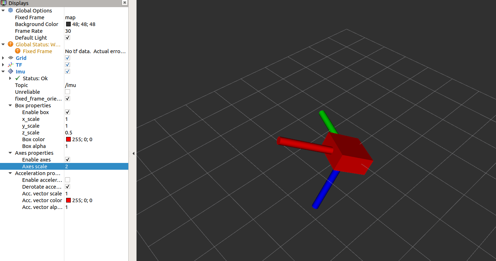
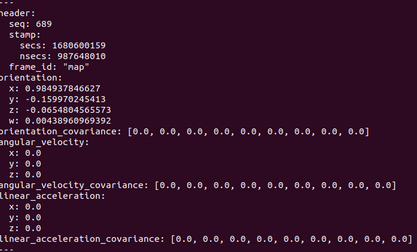
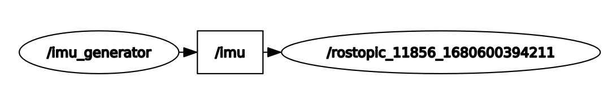

## RVIZ imu veiwer 실습

- [rospkg.RosPack()](http://docs.ros.org/en/independent/api/rospkg/html/python_api.html)
- 구성해야할 topic
    
    ```python
    std_msgs/Header header # header (시퀀스번호와 시간, 아이디 정보를 담음)
    	uint32 seq
    	time stamp
    	string frame_id
    geometry_msgs/Quaternion orientation	# Quaternion 정보를 지님
    	float64 x
    	float64 y
    	float64 z
    	float64 w
    ```
    
- python file
    
    ```python
    #!/usr/bin/env python
    #-*- coding: utf-8-*-
    import rospy, math, os, rospkg
    from sensor_msgs.msg import Imu
    from tf.transformations import quaternion_from_euler
    
    # publisher 노드 선언 imu 타입 토픽 정의 
    
    rospy.init_node('imu_generator')
    pub = rospy.Publisher('imu', Imu, queue_size = 1)
    
    path = rospkg.RosPack().get_path('rviz_imu')+"/src/imu_data.txt"
    f = file(path, "r") # txt file read
    lines = f.readlines() # all file read -> readline(1 line) , readlines(all)
    
    imu_data = []
    
    imuMsg = Imu()
    imuMsg.header.frame_id = 'map' # Imu header frame id를 map으로 지정
    r = rospy.Rate(10)
    seq = 0
    
    # imu_data.txt 파일에서 한줄씩 읽음
    if os.path.exists(path):
    	for line in lines: # roll, pitch , yaw 각 값 저장
    		line = line.replace(':',',')
    		tmp = line.split(",")
    		extract = quaternion_from_euler(float(tmp[1]), float(tmp[3]), float(tmp[5]))
    		imuMsg.orientation.x = extract[0]
    		imuMsg.orientation.y = extract[1]
    		imuMsg.orientation.z = extract[2]
    		imuMsg.orientation.w = extract[3]
    
    		# header 정보 추가하기
    		imuMsg.header.stamp = rospy.Time.now()
    		imuMsg.header.seq = seq
    		seq = seq + 1
    
    		# 토픽에 담아 밖으로 publish
    		pub.publish(imuMsg)
    		r.sleep()
    ```
- 결과




