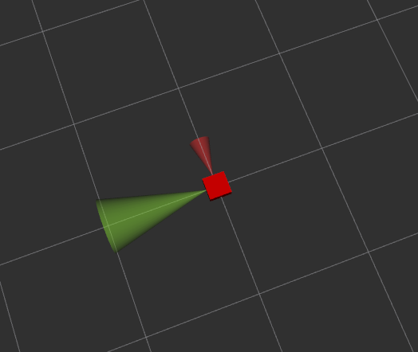

# 230404 - RVIZ기반 라이다 뷰어 제작
## 1. 과제설명
- lidar bag file 을 기반으로  /scan을 받기
- /scan 값 중 4개의 값을 이용해 /scan1 ~ /scan4 Range 토픽생성
- rviz 를 통한 visualization

## 2. 과제 진행방법

- 패키지 구성
```
rviz_lidar
├── launch
|   └── lidar_urdf.launch 
├── src
|   └── lidar_urdf.py # laserscan type -> Range convert
├── urdf
|   └── lidar_urdf.urdf 
└── rviz
    └── lidar_urdf.rviz
```
- 파일작성 전략
    - lidar_urdf.py 파일의 경우 기존의 lidar_scan.py 파일(sub), lidar_range.py (pub)를 참고해서 작성한다.
    - urdf파일은 baselink -> baseplate(visual box 생성)-> joint -> link(front,back,right,left) / meta color 등록
- 파일작성
    - [lidar_urdf.py](./src/lidar_urdf.py)
    - [lidar_urdf.launch](./launch/lidar_urdf.launch)
    - [lidar_urdf.urdf](./urdf/lidar_urdf.urdf)

## 3. 결과
- 다음과 같은 라이다 백파일을

 

- Range로 표현할 수 있었다.



- rqt_graph 를 살펴보면 다음과 같다.


