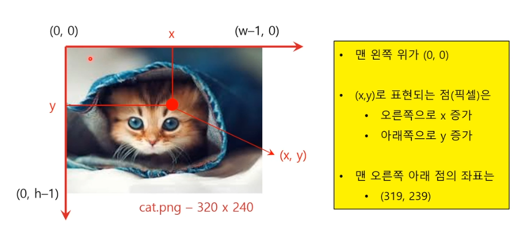

# 230410


## OpenCV 영상처리 기초 1

오픈소스  :  BSD 라이선스( opencv 사용했다고 밝히면 무료 )

- openCV 버전 1: c , 2:c ++ 3: 모듈 합침, OpenCL 지원 실행속도 개선 , 4: 딥러닝 패키지 추가

## OpenCV 영상처리 기초 2

- 640 x 480 해상도의 이미지 : 배열의 형태는 480 (h) x 640 (w) x 3 (B G R)
- (B,G,R) - 각 픽셀의 데이터 형은 numpy.ndarray (heigths(rows) x width(columns)
- 좌표값 표시에 순서쌍(tuple)이용
    
    
    

### 이미지 파일 다루기

- 이미지 읽기, 표시, 저장
    
    ```python
    # 파일 읽기
    # 사용법 : cv2.imread(fileName, flag(1(color), 0 (gray), -1(unchanged))
    img = cv2.imread('lena.jpg', cv2.IMREAD_COLOR)
    
    # 화면에 이미지 표시
    # 사용법 : cv2.imshow(title, image)
    cv2.imshow('windows name', img)
    
    # 이미지를 파일로 저장
    # 사용법 : cv2.imwrite(fileName, image)
    cv2.imwrite('lenagray.png', gray)
    ```
    
- 예시
    
    ```python
    import cv2
    
    img = cv2.imread('test.png', cv2.IMREAD_COLOR)
    cv2.imshow('My Girl', img)
    
    cv2.waitKey(1000)
    cv2.destroyAllWindows()
    ```
    
- gray / color image 차이
- 예시 : 이미지에서 흰점 하나 찾기
    
    ```python
    import cv2 
    
    img = cv2.imread('spot.png', cv2.IMREAD_GRAYSCALE)
    h = img.shape[0]
    w = img.shape[1]
    print("The image dimension is %d x %d" % (w,h))
    
    for i in range(0, h - 1):
    	for j in range(0, w - 1):
    		if img[i, j] == 255:
    			print(i, j)
    cv2.imshow('spot', img)
    cv2.waiteKey(0)
    ```
    

### 기본도형그리기

- img 위에 다양한 도형을 그릴 수 있음
- `cv2.line()` , `cv2.circle()` , `cv2.rectangle()` , `cv2.putText()`
    
    ```python
    # 선 (line)
    # 사용법  : cv2.line(img, start, end, color, thickness)
    img = cv2.line(img, (0,0), (511,511), (255,0,0), 5)
    
    # 사각형 (rectangle)
    # 사용법 : cv2.rectangle(img, start, end, color, thickness)
    img = cv2.rectangle(img, (384, 0), (510, 128), (0,255,0), 3)
    
    # 원 (circle)
    # 사용법 : cv2.circle(img, center, radian, color, thickness)
    img = cv2.circle(img, (447,63), 63, (0,0,255), -1)
    
    # 텍스트 (text)
    cv2.putText(img, text, org, font, fontSacle, color)
    cv2.putText(img, 'OpenCV', (10,500), cv2.FONT_HERSHEY_SIMPLEX, 4, (255,255,255), 2)
    ```
    
- 예제 : 사각형 그리기
    
    ```python
    import cv2 
    img = cv2.imread("black.png', cv2.IMREAD_COLOR)
    img = cv2.rectangle(img, (100,100), (300,400), (0,255,0), 3)
    cv2.imshow('black', img)
    cv2.waitKey(10000)
    ```
    

### 관심영역 - ROI(Region of Interest)

- 이미지 내 관심영역 설정하는 일
- numpy.ndarray 다차원 배열의 slicing으로
    
    ```python
    import cv2
    img = cv2.imread('car.png')
    h, w, c= img.shape
    roi = img[120:240, 270:460] # h, w
    
    cv2.imshow('roi', roi)
    if cv2.waitKey(1) & 0xFF == ord('q'):
        break
    cv2.destroyAllWindows()
    ```
    

### HSV 색상정보

- H(hue)색상, S(saturation) 채도, V(value) 명도
    - Hue : 색의 질 , 노란색, 빨간색,,,
    - Saturation : 선명도, 원색일 수록 채도가 높음
    - Value : 밝기 , 명도가 높을 수록 백색에 , 낮을 수록 흑색에 가까워짐


- 색상과 명도 범위로 차선인식
    
    ```python
    import cv2
    import numpy as np
    
    img = cv2.imread('car.png')
    hsv = cv2.cvtColor(img, cv2.COLOR_BGR2HSV)
    
    lower_white = np.array([0,0,150])
    upper_white = np.array([179,255,255])
    
    mask = cv2.inRange(hsv, lower_white, upper_white)
    
    cv2.imshow('line', mask)
    cv2.waitKey(10000)
    ```
    
    
    


### 동영상 파일 읽어서 표시하기

- 프레임 (영상내에서 한장 한장의미)
- 프레임 단위의 이미지를 분석하여 주행 제어 결정
- 카메라로부터 영상정보를 받아 표시하는 것과 동일함 (영상 재생이 끝나면 VideoCapture를 닫고 끔)
    
    ```python
    import cv2 
    
    vid = cv2.VideoCapture('small.avi')
    
    while True:
    	ret, frame = vid.read()
    	if not ret:
    		break
    	if ret:
    		cv2.imshow('video', frame)
    	if cv2.waitKey(1) > 0:
    		break
    vid.release()
    cv2.destroyAllWindows()
    ```
    
    
    

## OpenCV 자이카 카메라 활용

### 자이카에 장착된 카메라 장치

- opencv 의 remap 과 같은 함수로 왜곡 형상을 펴서 표현할 수 있음


- 카메라 활용 사례
    - 차선 찾아서 차선을 벗어나지 않고 주행하도록 만들기
    - 사람을 찾아서 쫒아가기
    - 앞차의 뒤꽁무니를 찾아서 앞차를 따라가도록 (군집주행) 만들기
    - 카메라를 이용한 주변상황 인지
        - 전방이동물체 인식, 전방 고정물체 인식
    - 카메라 영상으로 자기위치 파악(localization)
        - 앞에 펼쳐진 전경을 보고, 또는 지형지물을 보고, 지도 데이터와 비교하여 현재 차량의 위치를 유추
- 카메라 위치 조정 아이콘을 이용해서 격자선으로 카메라가 바라보는 방향 셋팅

### 카메라 관련 ROS 패키지

- 카메라로 영상을 담아서 토픽으로 보내주는 패키지임 ~/usb_cam
- /usb_cam/image_raw , /usb_cam/image_raw/compressed 토픽 사용
    
    
    


# ⚒️ week 5-1 실습

## [실습] 명도차 기반 차선 인식 주행

## [과제] RVIZ 차선 인식 주행

### 과제설명 : OpenCV와 rosbag을 이용한 차선인식 주행

- rosbag을 받아서 → 가상공간에서 움직일 수 있게 함


- 차선 인식 주행 : 차선을 인식하면 주행할 수 있도록 함
    - 좌우 차선을 찾아내어 차선을 벗어나지 않게끔 주행하기
    - 카메라 입력으로 취득한 영상에서 적절한 영역을 잘라냄
    - 이진화 후 바깥에서 중앙으로 가면서 흰색 점을 찾음
    - 그 점 주위에 사각형을 쳐서 사각형 안에 있는 흰색점의 개수를 구함 , 기준 개수 이상이면 바로 거기가 차선!
        
        ```python
        # image read
        # gray scale
        # gaussian blur
        # hsv and binary
        # ROI 
        # 위치 파악, 핸들 꺽기
        ```
        
- 파일 구조
    
    ```python
    lidar_drive
    ├── launch
    |   ├── line_follow.launch # rosbag launch 가 포함되어있지 않음
    |   └── line_follow_rosbag.launch
    └── src
        ├── line_follow.py
        └── cam_topic.bag
    ```
    
    
    
- full.bag 파일에서 cam topic만 recode 하는 방법 /  동영상 저장 방법
    
    ```python
    $ rosbag record -O cam_topic /usb_cam/image_raw/ # rosbag recoding (Ctrl+C 녹화종료)
    
    $ rosbag play full_topic.bag
    $ rosbag info cam_topic.bag # msg 어떻게 저장 되었는지 확인 
    
    # 동영상으로 저장 (bag to avi)
    $ roscore
    $ rosrun image_view video_recorder image:='/usb_cam/image_raw' _filename:='track2.avi' _fps:=30 # image save
    $ rosbag play cam_topic.bag
    ```
    
- line_follow.py 프로그래밍
    
    
    
- 조향각 설정
    - 인식된 양쪽 차선의 중점
    - 몇 픽셀에 1도를 꺾어야 할까?
- launch file
    
    ```python
    param : xycar_3d.urdf
    node : rviz + rviz_odom.rviz
    			 state_publisher
    			 converter.py
    			 rviz_odom.py
           line_follow.py
    + rosbag + cam_topic.bag
    ```
    
- 실행결과 - 가상공간에서 차량이 주행
    - 3개의 그림 표시 - roi&초록박스 / 영상 트랙 꺾임(ROI 영역 파란색 표시) /rviz 차량 움직임 일치
        
        
        
- 제출
    - 동영상
    - 파일
    - 문서

## [결과] RVIZ 차선 인식 주행

# 230410 week5-1 과제

1. 과제설명
- image rosbag file을 통해 rviz에서 차선인식 주행하기
- 폴더 구조

```
lidar_drive
├── launch
|   ├── line_follow.launch # rosbag launch 가 포함되어있지 않음
|   └── line_follow_rosbag.launch
└── src
    ├── line_follow.py
    └── cam_topic.bag

```

2. 과제진행 (파일 흐름)
- /usb_cam/image_raw topic 구독
- 토픽데이터를 opencv 이미지 데이터로 변환
- opencv 영상처리(ROI -> Grayscale -> Gaussian blur -> HSV binary)
- 차선 위치 찾기
- 조향 각 설정
- 모터 제어 토픽 발행
