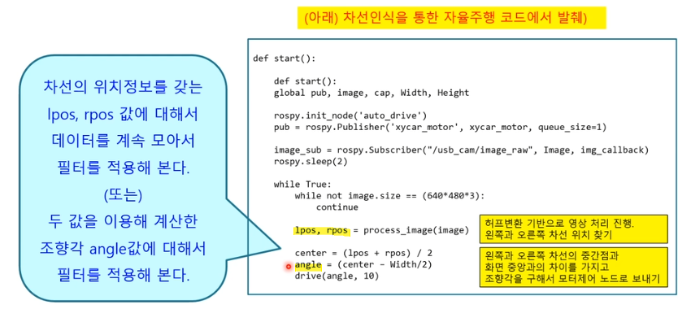

# 230412

## 필터기반 조향각 제어

### 차선위치 정보를 이용한 조향각 제어 방법

**자동차 운전 : 조향 및 속도 제어**

- 조향각 제어
    - 직선 : 정면 , 곡선 : 휘어진 방향
- 속도제어
    - 직선: 빠르게 , 곡선 : 속도 제어

**차선의 위치정보를 이용하여 주행할 수 있게끔!**

- 카메라를 통한 차선 인식의 한계점들 :  빛 , 그늘, 반사광, 장애물 때문에 차선이 가리는 경우
- 오류가 생기면 변동이 심해짐 → **전체 광이 밝아지거나 어두워지는 구간에서 threshold를 자동으로 설정할 수 있는 방법은?**
- 조향각이 자꾸 변하면 → 핸들이 심하게 움직임 , 차선이탈 위험이 있다!
- **부드러운 핸들링이 필요! (조향각 값에 대한 필터링)**

### 조향각에 대한 필터링

카메라 → 차선찾기 → 조향각 계산 → 필터 → 모터제어 

### 필터를 이용한 부드러운 핸들링 방법

### 간단한 필터들

- 평균 필터 Average filter
- 이동평균 필터 Moving average filter (너무 옛날 데이터는 사용하지 않음, 최근 N개만 이용)
- 가중 이동평균 필터 : 가장 최신데이터에 가중치를 둠
- 저주파 통과 필터 Low-pass filter : 지수가중 이동평균 필터

### 핸들링에는 어떤 필터가 적당할까?

- 이동평균 (과거 값 버리기)
- 가중 이동평균 필터 (최신값 중요)
- 차선위치 or 조향각 데이터에 적용
    
    
    

- 필터 코드 적용
    
    ```python
    class MovingAverage:
    	# init : ma = MovingAverage(50) # 50개 데이터만 항상 처리하겠다
    	def __init__(self, n):
    		self.samples = n
    		self.data = []
    		self.weights = list(range(1, n + 1))
    	
    	# sample 추가하기
    	def add_sampele(self, new_sample):
    		if len(self.data) < self.samples:
    			self.data.append(new_sample) # 새로운 샘플을 맨 뒤에 추가하기
    		else:
    			self.data = self.data[1:] + [new_sample] # 꽉 찼으면 제일 오래된 샘플 버리기
    		print("samples: %s" % self.data)
    
    	# 이동평균 필터	
    	def get_mm(self):
    		return float(sum(self.data)) / len(self.data) 
    
    	# 가중이동평균 필터
    	def get_wm(self):
    		s = 0
    		for i, x in enumerate(self.data):
    			s += x* self.weights[i]
    		return float(x) / sum(self.weigths[:len(self.data)]) 
    ```
    
    ```python
    def start():
    	
    	global pub, image, cap, video_mode, Width, Height
    	
    	# 가중이동평균을 구하기 위한 샘플 50개
    	mm1 = MovingAverage(50)
    
    	rospy.init_node('auto_drive')
    	pub = rospy.Publisher('xycar_motor', xycar_motor, queue_size = 1)
    	image_sub = rospy.Subscriber("/usb_cam/image_raw", Image, img_callback)
    	rospy.sleep(2)
    
    	while True:
    		while not image.size == (640*480*3): # 카메라 영상 이미지를 한장씩 처리
    			continue
    
    		lpos, rpos = process_image(image) # 왼쪽차선과 오른쪽 차선의 위치 찾기
    		center = (lpos + rpos) / 2 # 차선의 중점과 화면 중앙과의 차이값을 조향각으로 계산
    		angle = (center - width / 2)
    	
    		mm1.add_sample(angle)
    		wmm_angle = mm1.get_wmm() # 50개의 샘플에서 가중이동평균값 구하기
    		
    		drive(wmm_angle, 30) # 구해진 조향각(가중이동평균값)을 모터제어 노드로 보내기
    ```
    

## PID 기반 조향각 제어

→ 필터는 그러면 편차를 일정하게 뽑을 수 있는 것이고 이 이후에 PID 제어를 통해 부드럽게 하는 것인가?

### 제어개요

- Control 기법의 종류
    - Open Loop Control (결과에 대한 확인과정이 없음: Input → control → output)
    - Closed Loop Control (feedback이 있는 시스템 : Measuring element 과정이 있음)
- Closed loop control
    - 센서 등을 통해 데이터를 수집하고 , 수집된 데이터를 기반으로 반복적인 피드백으로 제어하는 기법
    - 대표적인 closed loop control 기법 → PID control


### 피드백 제어란?

- Process 를 거쳐서 나온 Output이 Input에 영향을 미치는 Loop
- 제어 값이 2개 밖에 없기 떄문에 일정값 주변을 맴도는 진동의 현상이 일어나게 됨


- On-Off를 반복 : 출력값의 변화가 매우 큼
- 시간이 지나도 목표값과의 오차는 줄어들지 않음
    
    
    

### PID 제어기

- 비례 : Propotional
- 적분 : Integral
- 미분 : Differential
- 제어 대상의 목표값(desired value)과 출력값(output)과의 차이로 제어값을 계산
    
    
    

### PID 제어 개요

- 주요용어 개념
    - 오버슈트 : 최종 정상상태 값을 넘어서는 상승오차
    - 피크 시간 : 가장 큰 overshoot가 발생했을 때 시간
    - 상승시간 : output의 0.1 ~ 0.9 까지 이를 때 걸리는 시간
    - 정착시간 : 최종 정상상태에 도달하는 시간
        
        
        
- PID 제어 수식
    
    
    

### P 제어 (비례 : Propotional)

- 피드백 제어신호가 오차에 비례하게 만드는 비례 제어기
    
    
    


- ex ) PID 제어기가 없을 때 : 목표값에 도달하지 않고 진동이 심함
- ex 1 ) PID 제어기를 넣을 경우
    - P gain 값이 작을 때 (P-gain = 1, I-gain = 1, D-gain =1)
    - 목표값에 도달은 하지만 오버슈트 발생
    - 반응속도 느림
- ex 2 ) P gain 값이 클 때
    - 상승시간이 줄어듬, 반응속도가 빠르다
    - 정상상태 오차(steedy-state error) 발생
        
        > 조작량이 너무 작아 측정오차 범위에 속하여 세밀한 제어가 힘들어질 수도 있다는 의미이다. 결국 목표치에 매우 가까운 상태로 안정되어 버리는 현상이 일어나고, 이때 목표치와의 편차가 잔류편차가 된다. 즉, **설정값에 매우 근한 상태에서 안정화되어버려 측정값과 설정값이 같아질 수가 없어진다**
        > 
        

### I 제어 ( 적분 : Integral )

- 오차의 잔류를 제거할 수 있음


- ex ) I gain이 증가 (P-gain = 5, I-gain=2, D-gain=1)
    - 반응속도가 빨라지고 정상상태 오차가 없어짐
    - but 오버슈트가 크게 발생

### D 제어 (미분 : Differential)

- 미분을 이용하여 진동을 줄이고 안정성을 향상하는 제어 방법
    - 급격한 출력값의 변동이 발생할 때 급격하게 변하지 않도록 함
    - 오차가 상수일 경우 D 제어기의 출력은 0이 되어 정상상태 오차를 줄일 수 없음


### 가장 이상적인 제어결과

- 빠른 응답속도
- 오버슈트가 발생하지 않음
- 정상상태 오차가 발생하지 않음
- gain 값사이의 trad-off를 적절히 타협 보기
- 주로 5% 이내의 오버슈트, 0.2초 이내의 정착시간을 설정함 → 시스템에 따라 달라져야함!

### PID 제어를 조향각 제어에 적용하기

- 목표 경로를 그대로 따라 가게끔!
- CTE(Cross Track Error)값을 0으로 만들기 - 트랙이 목표 궤적


P D 가 합쳐져서 최종적으로 빨간색으로 이동


적분제어까지 합친다면


### 자이카 조향각 계산법


```python
# PID class
class PID():
	
	def __init__(self, kp, ki, kd):
		
		self.Kp = kp
		self.Ki = ki
		self.Kd = kd
		self.p_error = 0.0
		self.i_error = 0.0
		self.d_error = 0.0

	def pid_control(self, cte):
		
		self.d_error = cte - self.p_error # D값은 cte(t) - 이전 p 값 차이 : 변화량
		self.p_error = cte # P 값은 CTE 값을 그대로 적용
		self.i_error += cte # I는 CTE누적 계속 더함 : 누적

		retrun self.Kp*self.p_error + self.Ki*self.i_error + self.Kd*self.d_error

# start driving

def start():
	global pub, image, cap, Width, Height

	rospy.init_node('auto_drive')
	pub = rospy.Publisher('xycar_motor', xycar_motor, queue_size=1)

	image_sub = rospy.Subscriber("/usb_cam/image_raw", Image, img_callback)
	print " --------------xycar A2 v1.0------------"
	
	while True:
		while not image.size == (640*480*4):
			continue
		lpos, rpos = process_image(image)
		center = (lpos + rpos) / 2
		error = (center - width/2)
		angle = (pid.pid_control(error))
		drive(angle, 30)	
		
```


| 속도 | P / I / D | 결과 |
| --- | --- | --- |
| 낮은 속도 | 0.45 / 0.0007 / 0.25 | 차 안정적 |
| 높은 속도 | 0.55/x/0.4 | 살짝 흔들림 |

---

**[🆙 목차로 돌아가기 🔗](https://www.notion.so/230412-2bf9c779056b4647aa537c37871cf462)** 

---

# ⚒️ week 실습

## [과제 1] 허프변환 기반 차선인식 주행

- 실제 트랙에서 차선을 벗어나지 않고 주행
    - 카메라로 촬영한 차량 전방 도로 영상에서 OpenCV를 이용하여 차선을 찾고 양쪽 차선의 위치를 따져서 핸들을 얼마나 꺾을지 조향각을 결정
- 차선인식 주행을 위해 필요한 것들
    - 카메라 입력 데이터 프레임 취득하기 (카메라 토픽 구독)
    - 얻어낸 영상 데이터 처리
        - BGR to Gray Scale
        - 외곽선 추출 : Canny
        - 관심영역 ROI 잘라내기
    - 차선검출 : 허프변환으로 직선찾기
        - 양쪽 차선을 나타내는 평균 직선 구하기
        - 수평선을 긋고 양쪽 직선과 교점 좌표 구하기
    - 차선위치를 기준으로 조향각 결정
        - 차선의 중앙을 차량이 달리도록
    - 결정한 조향각에 따라 조향 모터를 제어
        - 모터제어 토픽 발행
    
    
    
    → 빨간색 사각형과 초록색 사각형이 일치하도록 조향각을 설정해야함
    

### 허프변환을 이용한 차선 찾기

- Image Read : 카메라 영상신호 이미지 읽기
- GrayScale : 흑백 이미지로 변환
- Gaussian Blur : 노이즈 제거
- Canny : Edge 검출
- ROI : 관심영역 잘라내기
- HoughLinesP : 선분검출
- 차선 위치 파악
- 핸들꺾기


hough_drive.launch


hough_drive.py

- 실행결과 미리 보기
    - 카메라 영상데이터 수집
    - 좌우 차선 위와 두 점 중간 위치에 녹색 사각형
    - 화면의 중앙점에 빨간색
    - 차량이 벗어나지 않고 주행


## [과제 2] 슬라이딩 윈도우 기반 차선인식 주행

- 실제 트랙에서 차선을 벗어나지 않고 주행


## [과제 3]  필터적용

[과제 #1] 조향각 데이터가 아닌 차선위치 데이터에 적용해보자

```python
def start():
	
	global pub, image, cap, video_mode, Width, Height
	
	# 가중이동평균을 구하기 위한 샘플 50개
	ml1 = MovingAverage(50)
	mr1 = MovingAverage(50)

	rospy.init_node('auto_drive')
	pub = rospy.Publisher('xycar_motor', xycar_motor, queue_size = 1)
	image_sub = rospy.Subscriber("/usb_cam/image_raw", Image, img_callback)
	rospy.sleep(2)

	while True:
		while not image.size == (640*480*3): # 카메라 영상 이미지를 한장씩 처리
			continue

		lpos, rpos = process_image(image) # 왼쪽차선과 오른쪽 차선의 위치 찾기
		ml1.add_sample(lpos)
		mr1.add_sample(rpos)
		ml_pos , mr_pos = ml1.get_wmm(), mr1.get_wmm()

		center = (ml_pos + mr_pos) / 2 # 차선의 중점과 화면 중앙과의 차이값을 조향각으로 계산
		angle = (center - width / 2)
	
	
		drive(angle , 30) # 구해진 조향각(가중이동평균값)을 모터제어 노드로 보내기
```

[과제 #2] 차량의 속도가 느릴때와 빠를때, 어떤 필터가 효과적인지 알아보자 (저속주행 / 고속주행)

## [과제 4] PID 제어

과제 1 : 자이카 D 모델의 PID gain 값 찾기

과제 2 : PID gain 값 찾기 - 속도!와 관련해서 부드러운 제어하기

- https://www.slideshare.net/dheeruee/pid-control-45432861

## 과제 tip


→ 각도가 일정할 수 있도록 조정

→ 트랙 차선이 보이지 않는 경우 (반사광, 차선이 급하게 휘어지는 경우 , 다른 선 인지) 


→ 왼쪽차선인지 오른쪽 차선인지 구분 하는 방법 : ROI 앞 뒤쪽 이나 차선이 휘어지는 각도 쪽을 찾아서 구분하기 ? ⇒ 일정 거리를 뛰어서 주행하기

### 조향 및 속도 제어

- 조향각 제어
    - 직선 차로 : 정면
    - 곡선차로 : 차로가 휘어진 방향으로 조향
- 속도 제어
    - 직선 빠르게!
    - 곡선은 천천히!


# TIL

- hough 실습 1차안
    
    ```python
    #!/usr/bin/env python
    # -*- coding: utf-8 -*-
    
    import rospy, rospkg
    import numpy as np
    import cv2, random, math
    from cv_bridge import CvBridge
    from xycar_motor.msg import xycar_motor
    from sensor_msgs.msg import Image
    from collections import deque
    
    import sys
    import os
    import signal
    
    #pid 제어
    class PidControl:
       
        def __init__(self, kp, ki, kd):
            self.kp = kp
            self.ki = ki
            self.kd = kd
            self.p_error = 0
            self.i_error = 0
            self.d_error = 0
    
        def pid_control(self, cte):
            self.d_error = cte-self.p_error
            self.p_error = cte
            if cte:
                self.i_error+=cte
            else:
                self.i_error = 0
            return self.kp*self.p_error+self.ki*self.i_error+self.kd*self.d_error
    
    class MovingAverage:
        def __init__(self, n):
            self.samples = n
            self.data = deque()
            self.weights = list(range(1, n+1))
    
        def add_sample(self, new_sample):
            if self.data and self.data[-1]*new_sample < 0:
                self.data = deque()
                self.data.append(new_sample)
            elif len(self.data) < self.samples:
                self.data.append(new_sample)
            else:
                self.data.popleft()
                self.data.append(new_sample)
    
        def get_mm(self):
            return float(sum(self.data)) / len(self.data)
    
        def get_wmm(self):
            total = 0
            length = 0
            for i, data in enumerate(self.data):
                total += (i+1) * data
                length += (i+1)
            vector = np.vectorize(np.float)
            total = vector(total)
            return total / length
    
        def get_emm(self):
            total = 0
            length = 0
            for i, data in enumerate(self.data):
                total += ((i+1)**2) * data
                length += (i+1)**2
            vector = np.vectorize(np.float)
            total = vector(total)
            return total / length
    
    def signal_handler(sig, frame):
        os.system('killall -9 python rosout')
        sys.exit(0)
    
    signal.signal(signal.SIGINT, signal_handler)
    
    image = np.empty(shape=[0])
    bridge = CvBridge()
    pub = None
    Width = 640
    Height = 480
    Offset = 350#370
    Gap = 40#60 #40
    
    def img_callback(data):
        global image    
        image = bridge.imgmsg_to_cv2(data, "bgr8")
    
    # publish xycar_motor msg
    def drive(Angle, Speed): 
        global pub
    
        msg = xycar_motor()
        msg.angle = Angle
        msg.speed = Speed
    
        pub.publish(msg)
    
    # draw lines
    def draw_lines(img, lines):
        global Offset
        for line in lines:
            x1, y1, x2, y2 = line[0]
            color = (random.randint(0, 255), random.randint(0, 255), random.randint(0, 255))
            img = cv2.line(img, (x1, y1+Offset), (x2, y2+Offset), color, 2)
        return img
    
    # draw rectangle
    def draw_rectangle(img, lpos, rpos, offset=0):
        center = (lpos + rpos) / 2
    
        cv2.rectangle(img, (lpos - 5, 15 + offset),
                           (lpos + 5, 25 + offset),
                           (0, 255, 0), 2)
        cv2.rectangle(img, (rpos - 5, 15 + offset),
                           (rpos + 5, 25 + offset),
                           (0, 255, 0), 2)
        cv2.rectangle(img, (center-5, 15 + offset),
                           (center+5, 25 + offset),
                           (0, 255, 0), 2)    
        cv2.rectangle(img, (315, 15 + offset),
                           (325, 25 + offset),
                           (0, 0, 255), 2)
        return img
    
    # left lines, right lines
    def divide_left_right(lines):
        global Width
        print("check", lines)
        low_slope_threshold = 0
        high_slope_threshold = 10
    
        # calculate slope & filtering with threshold
        slopes = []
        new_lines = []
    
        for line in lines:
            x1, y1, x2, y2 = line[0]
    
            if x2 - x1 == 0:
                slope = 0
            else:
                slope = float(y2-y1) / float(x2-x1)
            
            if abs(slope) > low_slope_threshold and abs(slope) < high_slope_threshold:
                slopes.append(slope)
                new_lines.append(line[0])
    
        # divide lines left to right
        left_lines = []
        right_lines = []
    
        for j in range(len(slopes)):
            Line = new_lines[j]
            slope = slopes[j]
    
            x1, y1, x2, y2 = Line
    
            if (slope < 0) and (x2 < Width/2 - 90):
                left_lines.append([Line.tolist()])
            elif (slope > 0) and (x1 > Width/2 + 90):
                right_lines.append([Line.tolist()])
    
        return left_lines, right_lines
    
    # get average m, b of lines
    def get_line_params(lines):
        # sum of x, y, m
        x_sum = 0.0
        y_sum = 0.0
        m_sum = 0.0
    
        size = len(lines)
        if size == 0:
            return 0, 0
    
        for line in lines:
            x1, y1, x2, y2 = line[0]
    
            x_sum += x1 + x2
            y_sum += y1 + y2
            m_sum += float(y2 - y1) / float(x2 - x1)
    
        x_avg = x_sum / (size * 2)
        y_avg = y_sum / (size * 2)
        m = m_sum / size
        b = y_avg - m * x_avg
    
        return m, b
    
    # get lpos, rpos
    def get_line_pos(img, lines, left=False, right=False):
        global Width, Height
        global Offset, Gap
    
        m, b = get_line_params(lines)
    
        if m == 0 and b == 0:
            if left:
                pos = 0
            if right:
                pos = Width
        else:
            y = Gap / 2
            pos = (y - b) / m
    
            b += Offset
            x1 = (Height - b) / float(m)
            x2 = ((Height/2) - b) / float(m)
    
            cv2.line(img, (int(x1), Height), (int(x2), (Height/2)), (255, 0,0), 3)
    
        return img, int(pos)
    
    # show image and return lpos, rpos
    def process_image(frame):
        global Width
        global Offset, Gap
    
        # gray
        gray = cv2.cvtColor(frame,cv2.COLOR_BGR2GRAY)
    
        # blur
        kernel_size = 5
        blur_gray = cv2.GaussianBlur(gray,(kernel_size, kernel_size), 0)
    
        # canny edge
        low_threshold = 60
        high_threshold = 70
        edge_img = cv2.Canny(np.uint8(blur_gray), low_threshold, high_threshold)
        cv2.imshow('canny_image', edge_img)
    
        # HoughLinesP
        roi = edge_img[Offset : Offset+Gap, 0 : Width]
        all_lines = cv2.HoughLinesP(roi,1,math.pi/180,30,30,10)
        cv2.imshow('roi', roi)
    
        # divide left, right lines
        if all_lines is None:
            return 0, 640
        left_lines, right_lines = divide_left_right(all_lines)
    
        # get center of lines
        frame, lpos = get_line_pos(frame, left_lines, left=True)
        frame, rpos = get_line_pos(frame, right_lines, right=True)
        # print(lpos)
        # draw lines
        frame = draw_lines(frame, left_lines)
        frame = draw_lines(frame, right_lines)
        frame = cv2.line(frame, (230, 235), (410, 235), (255,255,255), 2)
                                     
        # draw rectangle
        frame = draw_rectangle(frame, lpos, rpos, offset=Offset)
        #roi2 = cv2.cvtColor(roi, cv2.COLOR_GRAY2BGR)
        #roi2 = draw_rectangle(roi2, lpos, rpos)
    
        # show image
        cv2.imshow('calibration', frame)
    
        return lpos, rpos
    def draw_steer(image, steer_angle):
        global Width, Height, arrow_pic
    
        # read of steer_arrow
        arrow_pic = cv2.imread('steer_arrow.png', cv2.INREAD_COLOR)
    
        # to calcurate
        origin_Height = arrow_pic.shape[0]
        origin_Width = arrow_pic.shape[1]
        steer_wheel_center = origin_Height * 0.74
        arrow_Height = Height / 2
        arrow_Width = (arrow_Height * 462) / 728
    
        # rotate steer img by using steer angle
        matrix = cv2.getRotatedMatrix2D((origin_Width / 2, steer_wheel_center), (steer_angle) * 2.5, 0.7)
    
        # fit img 
        arrow_pic = cv2.warpAffine(arrow_pic, matrix, (origin_Width + 60, origin_Height))
        arrow_pic = cv2.resize(arrow_pic, dsize = (arrow_Width, arrow_Height), interpolation = cv2.INTER_AREA)
    
        # full image + steer angle
        gray_arrow = cv2.cvtColor(arrow_pic, cv2.COLOR_BGR2GRAY)
        _, mask = cv2.threshold(gray_arrow, 1, 255, cv2.THRESH_BINARY_INV)
    
        arrow_roi = image[arrow_Height : Height, 
                          (Width / 2 - arrow_Width / 2) : (Width / 2 + arrow_Width / 2)]
        arrow_roi = cv2.add(arrow_pic, arrow_roi, mask = mask)
    
        res = cv2.add(arrow_roi, arrow_pic)
    
        image[(Height - arrow_Height) : Height,
              (Width / 2 - arrow_Width / 2) : (Width / 2 + arrow_Width / 2)] = res
        
        cv2.imshow('steer', image)
    # def draw_angle(draw_image, steer_angle):
    #     cv2.putText(draw_image, str(steer_angle), (50,50), cv2.FONT_ITALIC, 1, (255,0,0), 2)
    
    #     cv2.imshow('angle', draw_image)
    def start():
        global pub
        global image
        global cap
        global Width, Height
    
        rospy.init_node('auto_drive')
        pub = rospy.Publisher('xycar_motor', xycar_motor, queue_size=1)
    
        image_sub = rospy.Subscriber("/usb_cam/image_raw", Image, img_callback)
        rospy.sleep(5)
    
        angle = 2.5
        angle_temp = 2.5 
        speed = 5
        angle_list = []
    
        mm = MovingAverage(40)
        ml = MovingAverage(10)
        mr = MovingAverage(10)
        pid = PidControl(0.56, 0.0007, 0.2)
    
        while True:
            while not image.size == (640*480*3):
                continue
    
            lpos, rpos = process_image(image)
            print(lpos, rpos)
            ml.add_sample(lpos)
            mr.add_sample(rpos)
    
            lpos = ml.get_wmm()
            rpos = mr.get_wmm()
    
            center = (lpos + rpos) / 2
            error = -(Width/2 - center)
    
            angle = pid.pid_control(error)
    
            mm.add_sample(angle)
            mean_angle = mm.get_wmm()
    
            if lpos==0 and rpos==640: # can't recognize lanes
                angle_temp = angle
                drive(angle_temp, 5)
                continue
                
    
            steer_angle = mean_angle * 0.4
            # draw_angle(image, mean_angle)
            if abs(mean_angle) >= 50:
                drive(50, 5)#10)
                print("1")
                print(mean_angle)
    
                # Offset = 360
            elif 30 < abs(mean_angle) < 50:
                if mean_angle < 0:
                    drive(-20, 7 )#12)
                else:
                    drive(20, 7 )#12)
    
                print("2")
                print(mean_angle)
                # Offset = 365
            else:
                drive(0, 8 )#15)
                # Offset = 370
                print("3")
                print(mean_angle)
    
            if cv2.waitKey(1) & 0xFF == ord('q'):
                break
    
        rospy.spin()
    
    if __name__ == '__main__':
    
        start()
    ```
