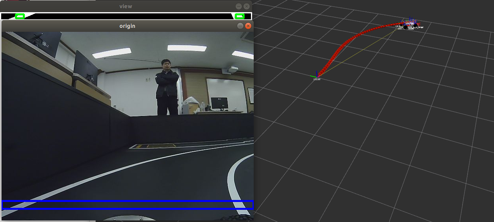

# 230410 week5-1 과제

### 1. 과제설명
- image rosbag file을 통해 rviz에서 차선인식 주행하기 
- 폴더 구조

```shell
lidar_drive
├── launch
|   ├── line_follow.launch # rosbag launch 가 포함되어있지 않음
|   └── line_follow_rosbag.launch
└── src
    ├── line_follow.py
    └── cam_topic.bag
```

### 2. 과제진행 (파일 흐름)
- /usb_cam/image_raw topic 구독
- 토픽데이터를 opencv 이미지 데이터로 변환
- opencv 영상처리(ROI -> Grayscale -> Gaussian blur -> HSV binary)
- 차선 위치 찾기
- 조향 각 설정
- 모터 제어 토픽 발행


### 3. 결과
- [line_follow_rosbag.launch](./launch/line_follow_rosbag.launch)
- [line_follow.py](./src/line_follow.py)
- 


