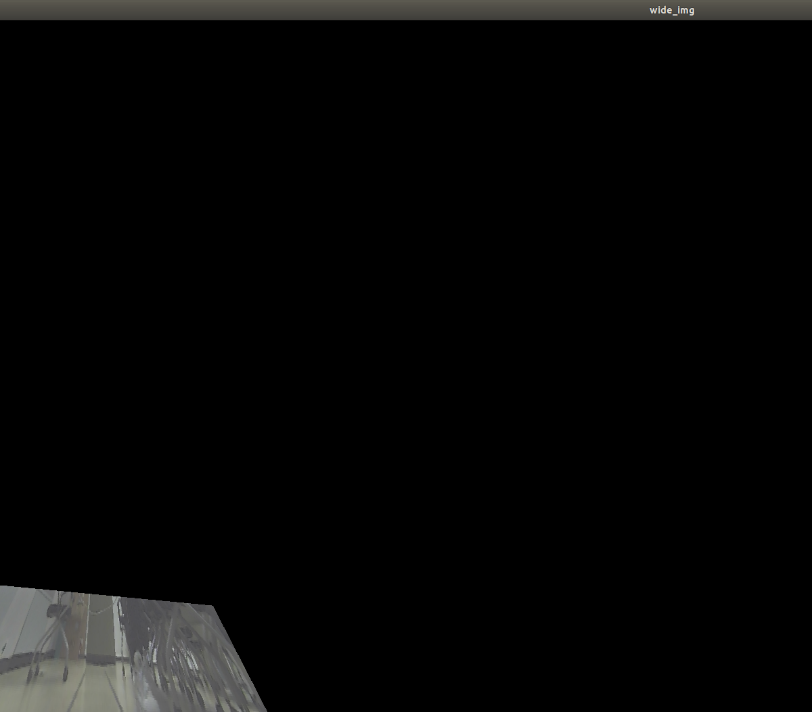

# 230413-14 week5 실습

과제설명
- 허프변환과 슬라이딩 윈도우 방법으로 차선 인식 주행을 진행했습니다.

요구사항과 구현내용
- 허프변환은 차선인식 후 주행까지 진행해 보았습니다.
- 슬라이딩 윈도우는 차선 인식까지 진행했습니다.
- PID와 Moving average filter 방식은 허프변환 코드와 연결까지는 진행했으나 튜닝을 진행하는것에 문제가 있어 제외하였습니다.

피드백 반영사항

PR포인트 & 궁금한점
- Sliding windows를 사용하였을 경우 차선의 영역을 보다 넓은 방향으로 보는 방법이 궁금하여, 두가지 접근 법을 고민해보았습니다. 
1) Margin을 좀 더 넓게 가져가는 방법
2) 차선 위의 4가지 점을 이용해서 변환행렬을 구하고, 그 변환행렬을 wide한 이미지에 젹용하여 변환하는 방법 
 
2번의 방법을 통해 시도해 보았을 때 아래 그림1 처럼 시도를 해보았는데 원하던 형태가 나오지 않았습니다.(그림 2:결과) 혹시 접근 방법이 문제인 것인지 추가적으로 변환이 필요한 것인지 궁금합니다. 

- 그림 1

- 그림 2

