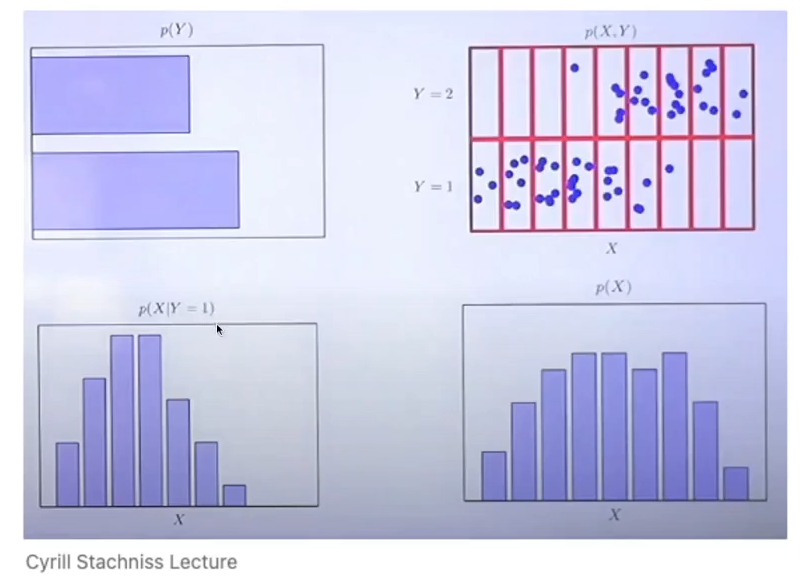

# 230417 - 로보틱스 기초 지식 및 컴퓨터 비전, OpenCV 

## 확률과 통계

- State Estimation
- Probability Theory


### State Estimation

- 로봇이 실제 세상에서 본인의 위치를 추론하기 위한 방법
    - 본인의 위치를 정확하게 추론하긴 어려움
        
        (모든 센서에는 노이즈가 포함되어있고, 노이즈는 확률적인 결과를 내보냄)
        
- 따라서 불확실성 사이에서 가장 높은 확률을 뽑아내고자 함
- 로봇은 어디있지? 물체는 어디있지?
- Kalman filter, VSLAM,,,,


### Probability Theory

${P(A)}$ : A가 참일 경우에 대한 확률을 표현

${P(true)=1}$ : A가 참일 경우 확률이 100 %

${P(false)=0}$ : A가 거짓일 경우 확률이 0%

${0≤P(A)≤1}$

${P(A\cup B)=P(A)+P(B)-P(A\cap B)}$

${P(A\cup A')=P(A)+P(A')-P(A\cap A')}$

- Discrete random variable
    - ${X=random variable}$
    - ${X= [ x_1, x_2, …. x_n]}$
    - ${P(X=x_i)=P(x_i)}$
- Continuous random variable
    - ${Pr(x \in [a,b])= \int_{a}^{b} p(x)\, dx}$
- Joint probability
    - ${P(X=x\ and \ Y=y)=P(x,y)}$
    - if X and Y are independent then ${P(x,y)=P(x)P(y)}$ 곱의 형태로 나타낼 수 있음
- Conditional  probablity
    - ${P(x|y)}$ is the probability of X given Y
        - ${P(x,y) = P(x|y)P(y)}$
        - ${P(x|y)=\frac{P(x,y)}{P(y)}}$
        - if X and Y are independent
            
            $$
             \begin{align} P(x|y)=&\frac{P(x,y)}{P(y)}\\ &\frac{P(x)(y)}{P(y)} \\ &P(x) \end{align}
            $$
            
            
            

- Bayes rule
    
    ${P(x|y) = \frac{P(y|x)P(x)}{P(y)} = \frac {likelihood*prior}{evidence}}$
    
    - x : 로봇 위치
    - y : 센서 값
    - y가 주어졌을 때 x를 구하는 확률 분포를 구하자! 라는 의미랑 같음
    - 현재 프레임에서 취득되는 센서의 값을 evidence 삼아서! 로봇의 위치를 추론하겠다
    - ${P(x)}$ → 초기 값이 될 수 있음
    - ${P(y|x)}$ : x가 주어진 상황에서 y가 나올 확률 : 현재로봇 위치에서 센서값의 확률
    - 반대도 됨!! : 로봇의 위치로 센서의 값을 구할 수도 있음 Localization ↔ Mapping

---

## 선형대수 Primer

- Vector and Matrices
- The Geometry of Least Squares
- Sigular Value Decomposition(SVD)

### Vector and Matrices

- vector : 1d data
- Matrix : a map from a vector to another
    
    
    
    - ${A_{inv}=A^{-1}}$

### The Geometry of Least Squares

- Linear regression (Optimization way)
    
    
    


세점에 대해서 가장 가까운 선을 찾는 방법

- Geometric 한 방법 : Matrix를 이용하는 방법
    
    
    

### singular value decomposition(SVD) - 데이터 속 중요한 개념을 뽑는방법

- Matrix decomposition
    - schur, LU, QR, Cholesky….
    - Composite matrix → Factorized matrices
- SVD
    - U : describes the characteristic
    - S : Describes the **weight** of this characterstic
    - V^T : Describes the characteristic
    
    
    

## CMake - CLION

- CMake
- [실습] Build 3rdParty
- [실습]Hello CMake

### CMake란

- system OS에 따라서 빌드 방식이 다름
- Cross compiler를 통해서 플랫폼에 맞도록 설계
- desktop (arm64) → Robot
- target system에 맞게 빌드 필요!
- CMake는 직접 빌드를 해주는 것은 아니고 빌드 커맨드를 생성해줌

CMAKE로 할 수 있는 것!

- Build 3rdParty libraries from source
    - OpenCV, Eigen,,,,,
- Make a C++ Project
    - Load your header / source files
    - Load 3rdParty libraries
    - Configure output executble /libraries

### Build 3rdParty

- folder 구조상 CMakeList가 있다면 CMake로 build가 가능하다고 볼 수 있음

```cpp
$ sudo apte-get install -y cmake # install cmake
$ git clone https://github.com/opencv/opencv.git
```

1) generate 단계 

- Read CMakeList → Cpp 구조 파악
- build system이 존재하는지
- 제자리에 모든 시스템이 있는지
- build command 소환

2) build 단계

폴더 생성

- build
- install → 완성된 build에서 유저가 직접사용할 라이브러리들만 시스템 폴더로 이동하는 것이 install 보통은 시스템 폴더로 가지만 원하는 곳에 설치하는 방법을 배우기 위해
    
    ```cpp
    # 보통 /usr/local/include 폴더 안에 설치가 되지만 (시스템에서 그냥 잡아줌) 
    # 동일한 library 의 다른 버전을 여러개 깔 때 문제가 될 수 있습니다.
    # 따라서 install folder를 이용함 ( 꼬임 피함, 지울때도 폴더만 싹! )
    ```
    

```cpp
$ cd build
$ cmake ../opencv #cmaklist 파일이 있는 경로를 찍으면 됩니다!

# TIP
# debug : debug 모든 정보를 제공! but 코드 최적화가 안됩니다.
# release : 최적화에 좋습니다. 디버깅이 어려워요

# -D : 파라미터를 의미합니다.
$ cmake -DCMAKE_BUILD_TYPE=Release \ # Release를 씁니다. 
	-GNinja \ # Ninja generate를 쓰겠습니다. 
	-DCMAKE_INSTALL_PREFIX=../install_thirdparty/install \# install 위치
	../opencv

# build file 생성해주기
$ cmake -DCMAKE_BUILD_TYPE=Release	-GNinja	-DCMAKE_INSTALL_PREFIX=../install 	../opencv

```

build 안의 폴더 확인해보기 

Makefile을 보면 확인 할 수 있음

```cpp
$ make -j4 # build 하기 ! -j는 병렬빌드함 : 빠른 빌드가 가능하지만 빌드 중 error가 나타 날 수 있으니 나타나면 주려서 하시면~! 램도 다 찰 수 있습니다... swap도 차지,,,,,
# core 수 보다 몇개 적게

$ ~/build/lib # 확인해 볼 수 있음
# install 은 필요한 파일들만 모아주는 과정임 
$ sudo make install # system folder에 다가 했을 때는 이렇게 해야함
# install/lib/cmkae/opencv/ 들어가보면 c++ link 해주는 파일이 있음
```


### [실습]Hello CMake

- cpp project 생성
    - cpp folder 구조 확립
    - opencv 사용 라이브러리 빌드
    - Opencv 사용하는 프로그램을 빌드
    - Opencv 와 eigen3를 사용하는 빌드

## 컴퓨터 비전의 개요[(황선규 강사님)](https://sunkyoo.github.io/)

- 컴퓨터 비전 개요
- 컴퓨터 비전 응용 분야

### 컴퓨터 비전이란

- 컴퓨터를 이용하여 정지영상 또는 동영상으로 부터 의미 있는 정보를 추출하는 방법을 연구하는 학문
- 컴퓨터 비전 == 영상처리 라고 하겠음
- 컴퓨터 비전과 휴먼비전의 영상 인식 특성에 대해 이해해야함
    
    
    


### 컴퓨터 비전 응용분야

- 영상화질 개선 (Filtering, HDR, Image Noise Reduction, Super Resolution)


- 내용 기반 영상 검색 (visual searching ,  google cloud vision API)
- 얼굴 검출 및 인식
    - 얼굴 검출(face detection) : 영상에서 얼굴의 위치와 크기를 찾는 기법
    - 얼굴 인식(face recognition) : 검출된 얼굴이 누구인지를 판단하는 기술
- 의료 영상처리
    - x-ray, ct, 영상 자동 분석 화질 개선
- 광학 문자 인식
    - OCR
- 마커인식 (2D 바코드, QR)
- 영상 기반 증강현실 (마커 & 비마커)
- 머신비전(machin vision)

## 영상 데이터 구조와 표현

### 영상 데이터 구조와 특징

- 영상(iage)이란 ?
    - Pixel이 바둑판 모양의 격자에 나열되어 있는 형태 (2차원 행렬)
    - 픽셀 : 영상의 기본 단위
- Grayscale iamge
    - 밝기 정보만 들어 있는 상태 [0 ~ 256) == [0,255] { [ 포함, ( 미포함}
        
        ```cpp
        // typedef : 타입의 별칭을 새로 정의
        typedef unsigned char BYTE; // 1byte :windows
        typedef unsigned char uint8_t; // Linux
        typedef unsigned char uchar; // OpenCV
        
        // 다음은 같음
        unsigned char LEN;
        unchar LEN2;
        ```
        

- Color image
    - R, G, B 각각 256
    - ${256^3=16777216}$
    
    ```cpp
    // unsigned char 자료형 3개 있는 배열 또는 구조체 (why)
    // 3Byte 사용
    class RGB
    {
    	unsigned char R;
    	unsigned char G;
    	unsigned char B;
    }
    ```
    


### 영상데이터 표현하기

- 정적 2차원 배열의 생성 ( 지양 - FHD 같은 경우 사용 할 수 없음 )
    - 2차원 배열 전체 크기만큼 메모리 공간이 연속적으로 할당됨 (640x480=307200 byte) x 3 (R,G,B)
    - 단점
        - 배열의 크기를 미리 알고 있어야함
            - 다양한 크기의 영상을 표현하기에 부적절
            - stack 영역에 메모리 할당 : 대략 1MB 까지 할당 가능
    
    ```cpp
    unsigned char a[480][640] {}; // 0으로 되는데 이런식으로 할당ㅎ지 않음
    ```
    
- 동적 2차원 배열의 생성 (생성하고 사용 후에는 해제하는 방식으로 작성)
    - 행 단위로만 연속된 메모리 공간이 보장됨
    - 프로그램 동작중 다양한 크기의 영상을 생성할 수 있음
    - Heap영역에 메모리 할당 : x86 의 경우 2GB 까지 할당 가능 (x64의 경우 8TB)
    
    ```cpp
    // grayscale
    int w = 640;
    int h = 480;
    
    unsigned char** p;
    p = new unsigned char*[h];
    for (int i = 0; i < h; i++){
    	p[i] = new unsigned char[w] {}'
    }
    
    //color
    
    int w = 640;
    int h = 480;
    
    // color 이미지를 나타내는 unsigned char 배열
    // 각 픽셀은 빨간색, 초록색 및 파란색 성분을 가짐
    unsigned char** p;
    p = new unsigned char*[h];
    for (int i = 0; i < h; i++) {
        p[i] = new unsigned char[w * 3] {}; // 각 픽셀당 3개의 unsigned char 값을 가짐
    }
    //픽셀의 값을 설정하려면, p[y][x*3], p[y][x*3+1] 및 p[y][x*3+2]의 각각의 값에 대해 적절한 unsigned char 값을 할당하면 됩니다.
    ```
    
- 설명
    1. **`int w = 640;`**와 **`int h = 480;`**는 배열의 너비와 높이를 지정합니다.
    2. **`unsigned char** p;`**는 포인터 변수 **`p`**를 선언합니다. 이 변수는 이차원 배열의 시작 주소를 저장할 것입니다.
    3. **`p = new unsigned char*[h];`**는 **`h`** 크기의 포인터 배열을 동적으로 할당합니다. 이 배열은 2차원 배열의 행의 주소를 저장할 것입니다.
    4. **`for (int i = 0; i < h; i++)`** 루프에서, **`p[i] = new unsigned char[w] {}`**은 **`w`** 크기의 unsigned char 배열을 동적으로 할당하고, 0으로 초기화한 후, **`p`**의 **`i`** 번째 요소에 해당 배열의 시작 주소를 저장합니다.
    
    결과적으로, **`p`**는 **`h`**x**`w`** 크기의 이차원 배열을 가리키는 포인터로 구성된 배열이 됩니다. 이 배열은 모든 요소가 0으로 초기화된 unsigned char 값으로 채워집니다.
    


```cpp
class MyImage
{
	public:
		MyImage() : w(0), h(0), data(0) {}
		MyImage(int _w, int _h) : w(_w), h(_h) {
			data = new unsigned char[w * h] {};
		}
		// MyImage 소멸자
		~MyImage() {
			if (data){
				delete[] data;
			}
		} 

		unsigned char& at(int x, int y) {
			return *(data + y * w + x);
		}

	public:
		int w;
		int h;
		unsigned char* data; // 동적할당할 데이터의 시작주소
};
```


## 영상파일 형식과 특징

- BMP 구조
- BMP 파일 출력 프로그램 만들기
- 영상 파일 형식과 특징

비트맵 (bitmap)

- 비트(bit)들의 집합(map) → 픽셀의 집합
- 영상의 전체 크기에 해당하는 픽셀 정보를 그대로 저장
    - 장) 표현이 직관적이고 분석이 용이
    - 단) 메모리 용량을 많이 차지, 영상 확대, 축소 시 화질 손상이 심함
- 사진, 포토샵

벡터 그래픽스(vector graphics)

- 점과 점을 연결해 수학적 원리로 그림을 그려 표현하는 방식
- 이미지 크기를 확대 또는 축소해도 화질이 손상되지 않음
- 폰트, 일러스트레이터

비트맵의 종류

- 장치 의존 비트맵(DDB)
    - 출력 장치(화면, 프린터 등)의 설정에 따라 다르게 표현됨
- 장치 독립 비트맵(DIB)
    - 출력 장치가 달라져도 동일하게 출력
    - BMP 파일은 windows 환경에서 비트맵을 DIB의 형태로 저장한 파일 포맷

### 비트맵의 파일의 구조

[BITMAPFILEHEADER(wingdi.h) - Win32 apps](https://learn.microsoft.com/ko-kr/windows/win32/api/wingdi/ns-wingdi-bitmapfileheader)


- WORD : 2Byte , DWORD : 4Byte → 비트맵은 전체 16byte


```cpp
// fileheader
typedef struct tagBITMAPFILEHEADER {
  WORD  bfType;
  DWORD bfSize;
  WORD  bfReserved1;
  WORD  bfReserved2;
  DWORD bfOffBits;
} BITMAPFILEHEADER, *LPBITMAPFILEHEADER, *PBITMAPFILEHEADER;
```

```cpp
// infoheader : size 
typedef struct tagBITMAPINFOHEADER {
  DWORD biSize; // BITMAPINFOHEADER 크기
  LONG  biWidth; // 비트맵 가로 크기
  LONG  biHeight; // 비트맵 세로 크기
  WORD  biPlanes; // 1
  WORD  biBitCount; // 픽셀 당 비트 수
  DWORD biCompression; // BI_RGB
  DWORD biSizeImage;
  LONG  biXPelsPerMeter;
  LONG  biYPelsPerMeter;
  DWORD biClrUsed;
  DWORD biClrImportant;
} BITMAPINFOHEADER, *LPBITMAPINFOHEADER, *PBITMAPINFOHEADER;
```

```cpp
// https://learn.microsoft.com/ko-kr/windows/win32/api/wingdi/ns-wingdi-rgbquad
typedef struct tagRGBQUAD {
  BYTE rgbBlue; // B
  BYTE rgbGreen; // G
  BYTE rgbRed;  // R
  BYTE rgbReserved; // 1byte -> 4의 배수로 맞춰주기 위함
} RGBQUAD;
```

- 픽셀데이터
    - 그레이스케일 비트맵: RGBQUAD 배열의 인덱스 저장
    - 트루컬러 비트맵 (B,G,R) 순서로 픽셀 값 저장
    
    
    


색상테이블이 존재 → Fixel당 데이터


색상 테이블 없이 바로 RGB 컬러 값이 옴

영상을 윈도우에 뛰우기  → 코드 보고 해보세요~!

- cat.bmp open
- bitfile, bitinfo header 크기 만큼 불러와서 구조체에 저장
- 불러온 영상의 w,h bitcount 저장
- true color 영상이면 3

BMP, JPG, GIF, PNG 파일 형식의 특징

- BMP :  픽셀 데이터를 압축하지 않고 그대로 저장 : 파일 용량이 큰편
- JPG : lossy compression - 픽셀 값이 바뀌는 !
- GIF : 256 색상 이하의 영상을 저장 : 무손실 압축이지만 일반 사진을 저장시 화질 열화가 심함
- PNG : 무손실 압축! 알파 채널 (투명도) 지원 / tif
- BMP (파일 큼 그대로 저장 ) 아니면 PNG 사용

영상데이터 크기 분석

- 그레이 스케일 영상  : w x h x bytes
- 컬러영상 : w x h x 3 bytes


## OpenCV 개요와 설치

## OpenCV 프로그램 개발 환경설정


# ⚒️ week 실습

# TIL
