# 230424

# 이동변환과 전단 변환

- 영상의 이동변환
- 영상의 전단변환

## 영상의 기하학적 변환(geometric transformation)

- 영상을 구성하는 픽셀의 배치 구조를 변경함으로써 전체 영상의 모양을 바꾸는 작업
- 전처리 작업, 영상 정합(image registration), 왜곡제거 등

](230424_img/Screenshot_from_2023-04-24_12-52-51.png)

[https://edward0im.github.io/mathematics/2020/06/03/multiple-view-geometry1/#org0436097](https://edward0im.github.io/mathematics/2020/06/03/multiple-view-geometry1/#org0436097)

### 이동변환 (translation transform - shift)

- 가로 또는 세로 방향으로 영상을 특정 크기만큼 이동시키는 변환
- x,y 방향으로 이동변위를 지정

$$
\begin{bmatrix}x'\\
y'\end{bmatrix}=\begin{bmatrix}1&0\\
0&1\end{bmatrix}
\begin{bmatrix}x\\
y\end{bmatrix}
+\begin{bmatrix}a\\
b \end{bmatrix}
$$

$$
\begin{bmatrix}x'\\
y' \end{bmatrix}=\begin{bmatrix}1&0&a\\
0&1&b\end{bmatrix}
\begin{bmatrix}x\\
y\\
1 \end{bmatrix}
$$

### 전단변환 (shear transformation)

- 직사각형 형태의 영상을 한쪽 방향으로 밀어서 평행사변형 모양으로 변형되는 변환, 층밀림 변환
- 가로 방향 또는 세로 방향으로 따로 정의됨
- 가로방향

$$
\begin{bmatrix}x'\\
y'\end{bmatrix}
=\begin{bmatrix}1&m\\
0&1 \end{bmatrix}
\begin{bmatrix}x\\
y\end{bmatrix}
$$

- 세로방향

$$
\begin{bmatrix}x'\\
y' \end{bmatrix}=\begin{bmatrix}1&0\\
m&1 \end{bmatrix}
\begin{bmatrix}x\\
y \end{bmatrix}
$$

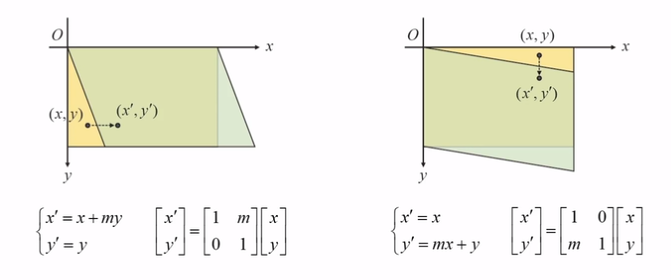

- 입력영상을 x shear / y shear 함

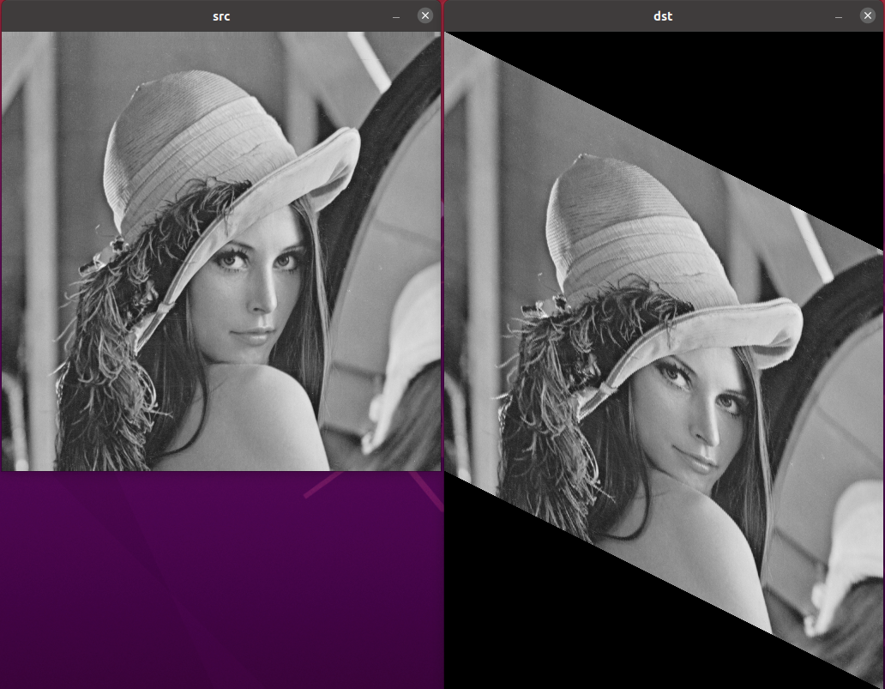


# 크기 변환과 보간법

- 영상의 크기변환
- 보간법
- resize() 함수

---

| 방법 | 설명 |
| --- | --- |
| 순방향 맵핑 | scale 증가시 빈공간 발생 |
| 역방향맵핑 | scale 증가시 빈공간은 없어지지만 단순하게 증가하기 때문에 계단형식(픽셀이 커지는 느낌)으로 출력됨 |
| 보간법(interpolation) | 영상을 조금 더 매끄럽게 출력하기 위해 실수 좌표상에서 픽셀 값을 결정하기 위해 주변 픽셀 값을 이용해 값을 추정하는 방법  |

## 영상의 크기 변환(scale transform)

- 영상의 크기를 원본 영상보다 크게 또는 작게 만드는 변환
- x축과 y축 방향으로의 스케일 비율(scale factor)를 지정

$$
\begin{bmatrix}x'\\
y' \end{bmatrix}=\begin{bmatrix}s_x&0\\
0&s_y \end{bmatrix}
\begin{bmatrix}x\\
y \end{bmatrix}
+\begin{bmatrix}0\\
0 \end{bmatrix}
$$

$$
\begin{bmatrix}x'\\
y'\end{bmatrix}=\begin{bmatrix}s_x&0&0\\
0&s_y&0\end{bmatrix}
\begin{bmatrix}x\\
y\\
1\\ \end{bmatrix}
$$

### 역방향 맵핑(backward mapping)

- 출력영상의 좌표를 입력영상의 좌표에 수식을 적용하여 계산하였는데 그것을 역으로 함
- 즉 입력영상의 좌표를 출력 영상의 좌표로 부터 계산
- 코드는 기존에 입력영상의 크기만큼 for 문을 도는 것과는 반대로 출력영상의 크기만큼 for 루프를 수행

### 보간법(interpolation)

- 역방향 매핑에 의한 크기 변환시 참조해야 할 입력 영상의 (x,y) 좌표가 실수 좌표라면?
    - (x,y) 와 가장 가까운 정수 좌표의 픽셀 값을 참조하거나
    - 또는 (x,y)근방의 정수 좌표 픽셀값을 이용하여 실수 좌표 위치의 픽셀 값을 추정
- 보간법이란 실수 좌표 상에서의 픽셀 값을 결정하기 위해 주변 픽셀 값을 이용하여 값을 추정

> 주요보간법
- 최근방 이웃 보간법(nearest neighbor interpolation)
- 양선형 보간법(bilinear interpolation)
- 3차 보간법(cubic interpolation)
- 스플라인 보간법(spline interpolation)
- 란쵸스 보간법(lanczos interpolation)
> 

- 최근방 이웃보간법(nearnest neighbor interpolation)
    - 가장 가까운 위치에 있는 픽셀 값 참조
    - 장) 빠름
    - 단) 계단현상(블록현상)
- 양선형 보간법(bilinear interpolation)
    - 실수 좌표를 둘러싸고 있는 네개의 픽셀 값에 가중치를 곱한 값들의 선형 합으로 결과 영상을 픽셀 값을 구하는 방법
    - 최근방에 비해 느리지만 비교적 빠르고, 계단 현상을 줄임
    
    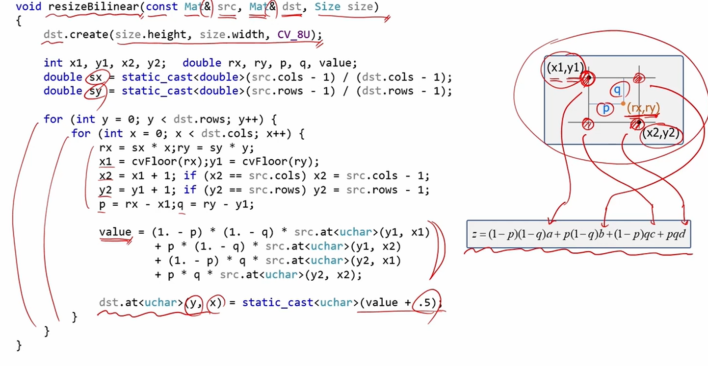
    
- 3차 보간법(bicubic interpolation)
    - 실수 좌표를 둘러싸고 있는 16개의 픽셀 값에 3차 함수를 이용한 가중치를 부여하여 결과영상 픽셀의 값을 계산

### resize()

```cpp
// color, gray 모두 지원
void resize(InputArray src, OutputArray dst, Size dsize, double fx = 0, double fy = 0, int interpolation = INTER_LINEAR);
```

- src , dst : 입력, 출력 영상
- dsize : 결과 영상의 크기, Size()를 지정하면 fx, fy에 의해 자동 결정됨
- fx, fy : x와 y방향 스케일 비율(sclae factor), dize 값이 0일 때 유효
- interpolation : 보간법 지정 상수
    
    
    | INTER_NEAREST | 가장 가까운 픽셀 값으로 보간 |
    | --- | --- |
    | INTER_LINEAR | 양선형 보간법(2x2) |
    | INTER_CUBIC | 3차회선 보간법(4x4 이웃) |
    | INTER_LANCZOS4 | Lanczos 보간법(8x8) |
    | INTER_AREA | 픽셀 영역 관계를 이용한 재샘플링 - 영상 축소에 좋음  |


- 영상의 축소시 고려할 사항
    - 입력 영상을 부드럽게 필더링한 후 축소하거나 다단계 축소 권장
    - INTER_AREA 플래그 사용

# 회전변환과 기하학적 변환의 조합

- 영상의 회전변환
- 기하학적 변환의 조합과 동차좌표계
- 대칭 변환

## 영상의 회전변환(rotation transform)

- 영상을 특정 각도만큼 회전시키는 변환
- OpenCV는 반시계 방향을 기본으로 사용
- 영상의 회전 변환시 주의사항
    - 출력영상의 좌표가 좌표값이 표현영역의 범위안인지
    - 역방향 매핑으로 구현해 빈 픽셀을 발생하지 않도록 해야함


- rotate라는 함수는 90, 270 등 특수각만 가능
- 두개의 함수를 조합해서 OpenCV 에서 사용할 수 있음
    - center : pt(src.cols/2.f, src.rows/2.f);


- full hd 급이면 느립니다

## 기하학적 변환의 조합과 동차 좌표계

- 크기변환과 회전변환 조합하기
    - 크기변환 → 회전변환
        
$$
\begin{bmatrix}x'\\
y' \end{bmatrix}=\begin{bmatrix}cos\theta&sin\theta\\
-sin\theta&cos\theta \end{bmatrix}
\begin{bmatrix}s_x&0\\
0&s_y \end{bmatrix}
\begin{bmatrix}x\\
y\end{bmatrix}
$$
        
    - 크기 → 회전 → 크기
        
$$
\begin{bmatrix}x'\\
y' \end{bmatrix}=\begin{bmatrix}s_x&0\\
0&s_y\end{bmatrix}
\begin{bmatrix}cos\theta&sin\theta\\
-sin\theta&cos\theta\end{bmatrix}
\begin{bmatrix}s_x&0\\
0&s_y \end{bmatrix}
\begin{bmatrix}x\\
y \end{bmatrix}
$$

- 이동변환, 크기변환, 회전변환 조합하기
    - 이동변환 → 크기변환
        
$$
\begin{bmatrix}x'\\
y' \end{bmatrix}=\begin{bmatrix}s_x&0\\
0&s_y \end{bmatrix}
\begin{pmatrix}\begin{bmatrix}x\\
y\end{bmatrix}+\begin{bmatrix}a\\
b \end{bmatrix}\end{pmatrix}
$$

    - 이동변환 → 크기변환 → 회전변환
        
$$
\begin{bmatrix}x'\\
y' \end{bmatrix}=\begin{bmatrix}cos\theta&sin\theta\\
-sin\theta&cos\theta
\end{bmatrix}
\begin{bmatrix}s_x&0\\
0&s_y \end{bmatrix}
\begin{pmatrix}\begin{bmatrix}x\\
y \end{bmatrix}+\begin{bmatrix}a\\
b\end{bmatrix}\end{pmatrix}
$$
        
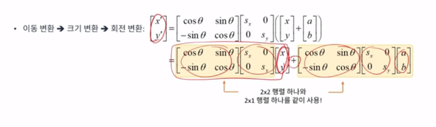
        
    - 덧셈을 제거하기 위해서 동차좌표계 등장
- 동차좌표계 (Homogenous coordinates)
    
    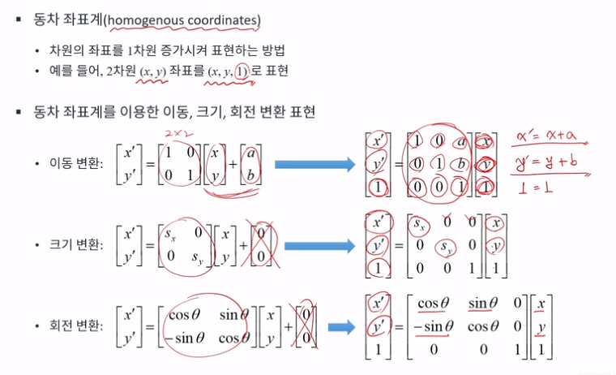
    
    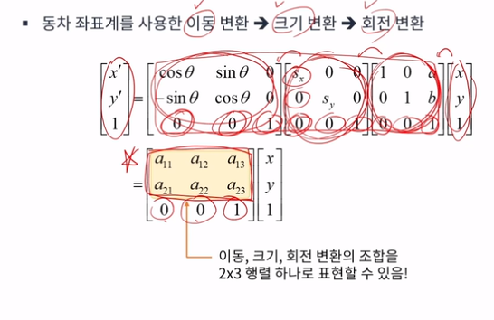
    
    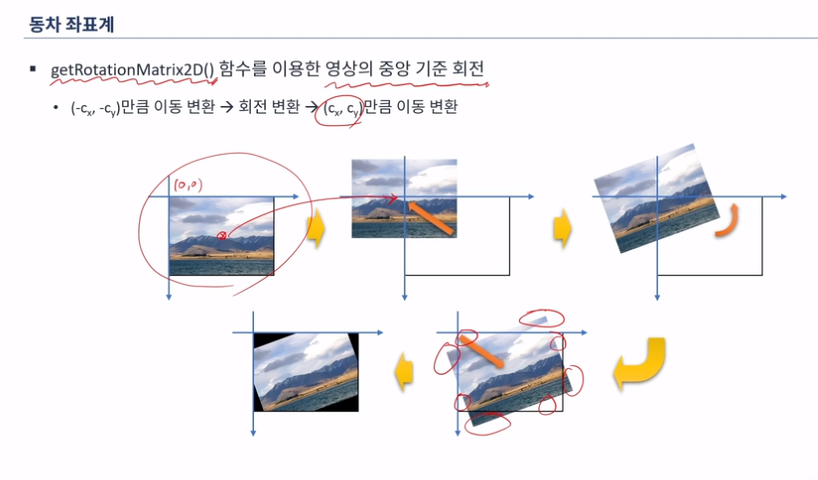
    
    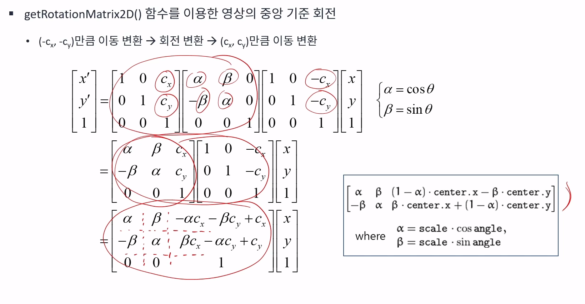
    

### 대칭 변환

- 영상대칭 변환(flip, reflection)
    - 상하, 좌우(-배 만큼 크기 변환 , 이동), 원점

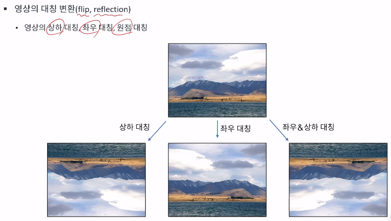

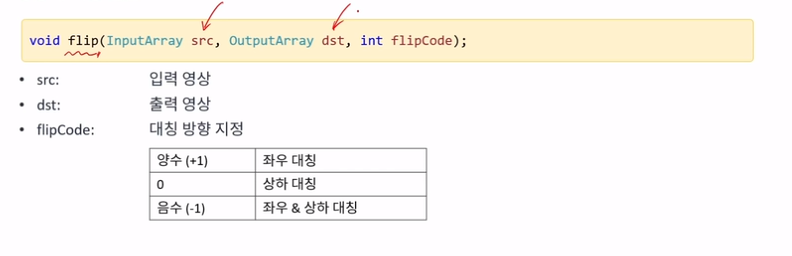

# 어파인 변환과 투시변환

- 어파인 변환과 투시 변환
- 차선영상의 버드아이뷰 만들기

### 어파인 변환(affine transform) vs 투시변환(perspective transform , projective, homography) (투영변환, 원근 변환)

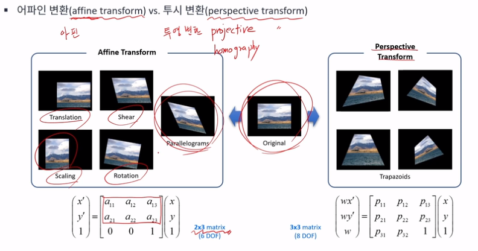

행렬 구하기

- 어파인 변환 : 6dof 필요  → 항상 평행사변형 형태로 표현됨 (3개의 점에 대한 이동만 알아도 나머지 한점에 대한 유추가 가능)
    
    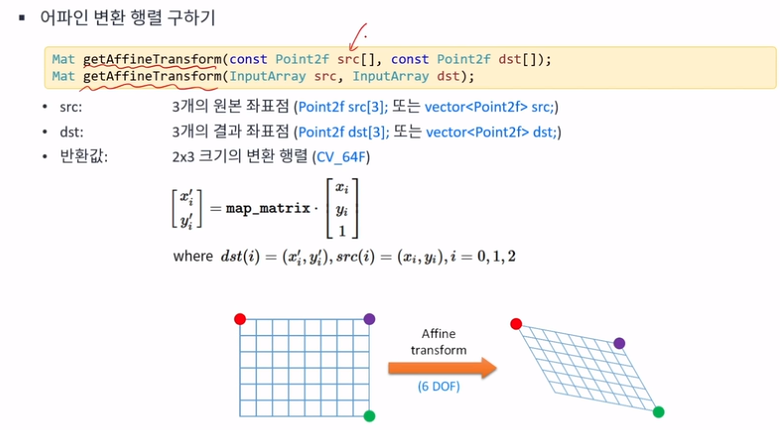
    
- 투시변환 : 8dof 필요 →8개의 점을 구해야함으로 4개점에 대해서 알아야함
    - input, output, perspective transform matrix를 구할 때 어떤 것들을 사용할 것인가정할 수 있음
    
    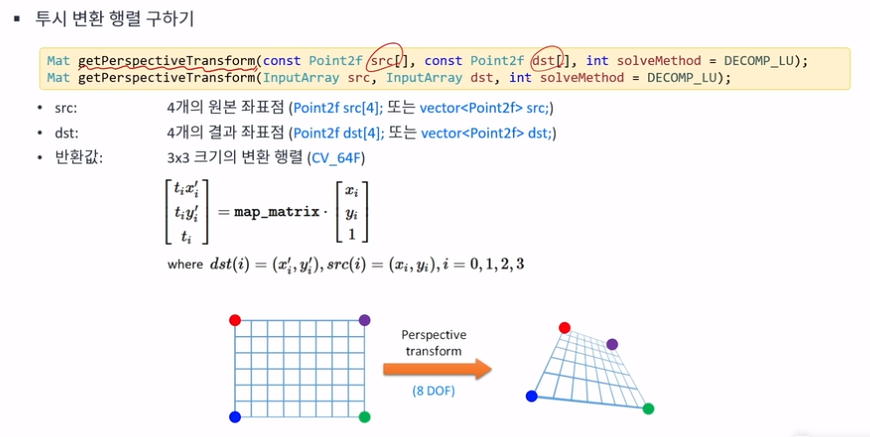
    
    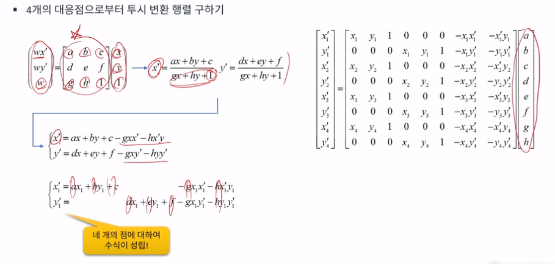
    
    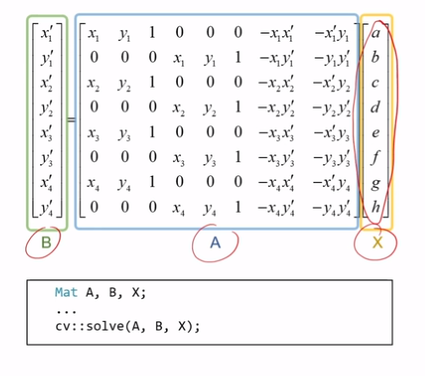
    

affine / 투영 변환

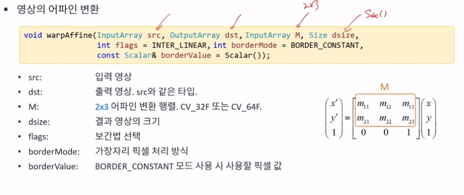

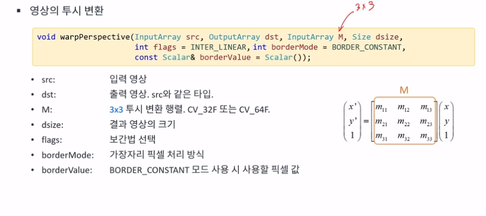

## 차선영상의 버드아이뷰 만들기

- bird’s-eye view
    - 투시변환을 이용함
    
    ```cpp
    #include <iostream>
    #include "opencv2/opencv.hpp"
    
    using namespace std;
    using namespace cv;
    
    int main()
    {
    	VideoCapture cap("../../data/test_video.mp4");
    
    	if (!cap.isOpened()) {
    		cerr << "Video open failed!" << endl;
    		return -1;
    	}
    
    	Mat src;
    	while (true) {
    		cap >> src;
    
    		if (src.empty())
    			break;
    
    		int w = 500, h = 260; // output size 임의 지정
    
    		vector<Point2f> src_pts(4);
    		vector<Point2f> dst_pts(4);
    
    		// 영상에서 차선의 끝 부분 지점 계산
    		src_pts[0] = Point2f(474, 400);	src_pts[1] = Point2f(710, 400);
    		src_pts[2] = Point2f(866, 530); src_pts[3] = Point2f(366, 530);
    
    		dst_pts[0] = Point2f(0, 0);		dst_pts[1] = Point2f(w - 1, 0);
    		dst_pts[2] = Point2f(w - 1, h - 1);	dst_pts[3] = Point2f(0, h - 1);
    
    		Mat per_mat = getPerspectiveTransform(src_pts, dst_pts); // 입력 -> 출력 변환행렬 
    
    		Mat dst;
    		warpPerspective(src, dst, per_mat, Size(w, h));
    
    #if 1
    		vector<Point> pts;
    		for (auto pt : src_pts) {
    			pts.push_back(Point(pt.x, pt.y)); //pt.x , pt.y : float -> Point type 변환 
    		}
    		polylines(src, pts, true, Scalar(0, 0, 255), 2, LINE_AA);
    #endif
    
    		imshow("src", src);
    		imshow("dst", dst);
    
    		if (waitKey(10) == 27)
    			break;
    	}
    }
    ```
    

# 리매핑

- 리매핑(remapping)
    - 영상의 특정 위치 픽셀을 다른 위치에 재배치하는 일반적인 프로세스
        
        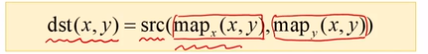
        
        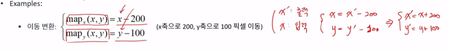
        
        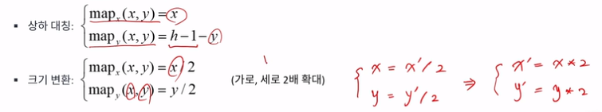
        
        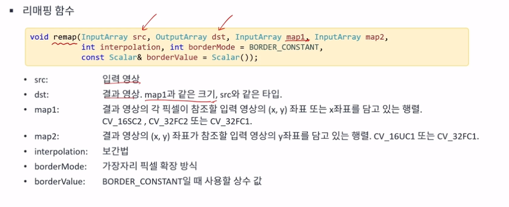
        
        - inter linear 혹은 inter cubic 쓰면 됨
        
        ```cpp
        #include <iostream>
        #include "opencv2/opencv.hpp"
        
        using namespace std;
        using namespace cv;
        
        int main()
        {
        	Mat src = imread("tekapo.bmp");
        
        	if (src.empty()) {
        		cerr << "Image laod failed!" << endl;
        		return -1;
        	}
        
        	int w = src.cols;
        	int h = src.rows;
        
        	Mat map1 = Mat::zeros(h*2, w*2, CV_32FC1);
        	Mat map2 = Mat::zeros(h*2, w*2, CV_32FC1);
        
        	for (int y = 0; y < h*2; y++) {
        		for (int x = 0; x < w*2; x++) {
        			map1.at<float>(y, x) = (float)x/2; // input img = output img
        			map2.at<float>(y, x) = (float)y;
        			//map2.at<float>(y, x) = (float)h - 1 - y; // 뒤집고 싶을 때
        			//map2.at<float>(y, x) = (float)y/2; // y 값을 줄이고 싶을 때
        			//map2.at<float>(y, x) = (float)y + 10*sin(x/32.f);
        		}
        	}
        
        	Mat dst;
        	remap(src, dst, map1, map2, INTER_LINEAR);
        	//remap(src, dst, map1, map2, INTER_LINEAR, BORDER_DEFAULT);
        
        	imshow("src", src);
        	imshow("dst", dst);
        	waitKey();
        }
        ```

