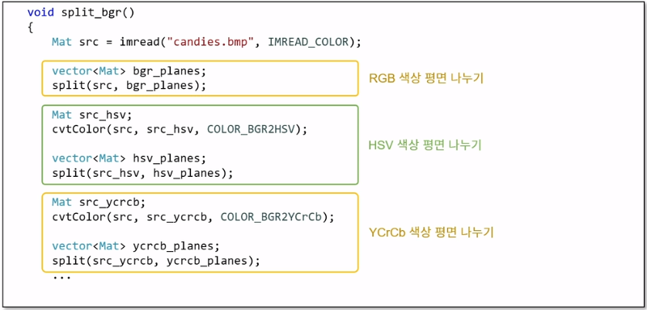
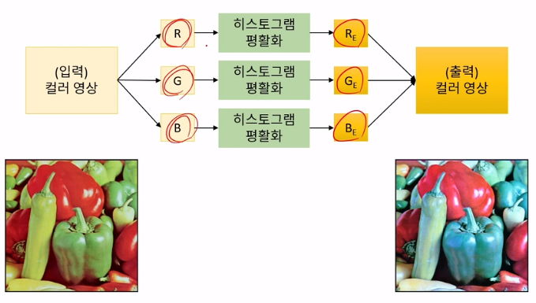
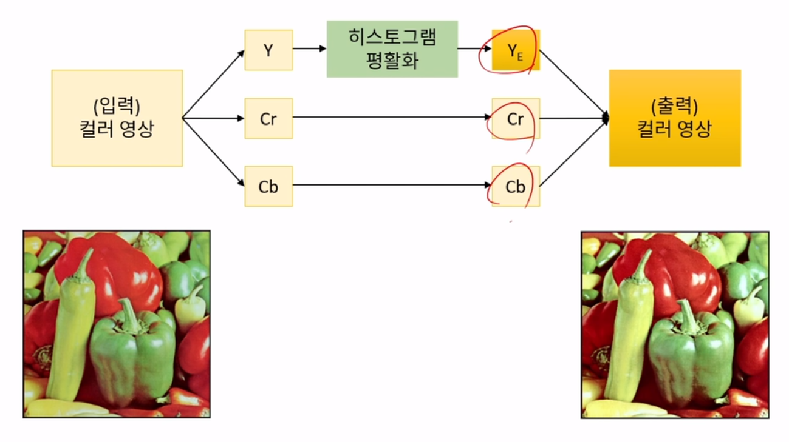

# 230425

# 1. 컬러영상처리의 기초

- opencv에서 컬러 영상 다루기
- 컬러 영상의 픽셀 값 참조
- 컬러 영상을 그레이 스케일 영상으로 변환

## 1-1.OpenCV에서 컬러 영상 다루기

- 빨강 R, 초록 G, 파랑 B 색 성분을 각각 256 단계로 표현
- CV_8UC3 타입으로 표현 : BGR순서를 기본으로 사용

```cpp
cv::Mat img1 = cv::imread("lenna.bmp", cv::IMREAD_COLOR); // == cv::imread("lenna.bmp")
cv::Mat img2(rows, cols, CV_8UC3);
```

```cpp
cv::Mat img3 = imread("lenna.bmp", IMREAD_GRAYSCALE);
cv::Mat img4;
cv::cvtColor(img3, img4, COLOR_GRAY2BGR);
```

- img3 -> img4 (B,G,R) 각 픽셀의 성분 값이 동일하게 설정
- 시각적으로 표현된 이미지는 img4 == img3
- img3 위에는 컬러채널의 도형을 그릴 수 없음 img4는 컬러 공간이기 때문에 가능

### 반전영상 만들기

- B 값을 제외하고 범위값에 벗어나는 연산이 됨

```cpp
cv::Mat src = cv::imread(input_img, cv::IMREAD_COLOR); 

cv::Mat dst = 255 - src; // == cv::Scalar(255,0,0,0) - src
// 255-B , 0 - G, 0 - R
```


- 정상적인 반전연산 만들기

```cpp
cv::Mat src = cv::imread(input_img, cv::IMREAD_COLOR); 

cv::Mat dst = cv::Scalar(255,255,255,0) - src;
```


[230418](https://www.notion.so/230418-e9cda30f0de54627ac6feb27288c73b8)

## 1-2.컬러 영상의 픽셀 값 참조

- 그레이영상
    
    ```cpp
    int vp = src.at<uchar>(y,x); // pixel 값을 int 받아옴
    ```
    
- BGR
    
    ```cpp
    cv::Vec3b& p1 = src.at<cv::Vec3b>(y, x);
    ```
    

- & 연산자와 관련하여
    
    
    
    
    

## 1-3.컬러 영상을 그레이스케일로 변환

- RGB → Gray ( Y = 0.299R + 0.587G + 0.114B (3:6:1))
    - 장점 : 메모리 용량 감소, 연산 처리 속도 향상
    - 색상정보 손실

```cpp
#define RGB2GRAY(r, g, b)((4899*(r) + 9617*(g) + 1868*(b))>>14)
// 14번 shift 연산 (기존의 0.299~~ 비율에 2^14 승을 곱한 것이 4899) -> 이걸 다시 역으로 2^14으로 나누는 것
// 1000으로 나누는 것보다 시프트연산자를 이용하여 빠르게 연산이 가능
// 2^16보다 작고 충분히 큰 수를 얻기 위해 사용

cv::Mat dst(src.rows, src.cols, CV_8UC3);
cv::Mat dst_gray(src.rows, src.cols, CV_8UC1);

// 아래 과정은 사실 cv::cvtColor(src, dst, COLOR_BGR2GRAY); 로 표현 가능 
for (int y = 0; y < src.rows; y++){
    for (int x = 0; x<src.cols ; x++){
        cv::Vec3b& p1 = src.at<cv::Vec3b>(y, x);
        uchar b = p1[0];
        uchar g = p1[1];
        uchar r = p1[2];
        // 실수연산을 많이 하면 느려짐
        uchar gray = (uchar)(0.2999 * r + 0.587 * g + 0.114 * b + 0.5);
        uchar gray_int = (uchar)((299*r+587*g+114*b)/1000); // 으로도 할 수 있지만 나눗셈이 비효율적
        // 이를 uchar gray= RGB2GRAY(r, g, b);
        dst.at<cv::Vec3b>(y, x) = gray;

    }
}
```


- dstCn을 설정하지 않으면 cvtColor에서 자동으로 설정

# 2. 색공간

- 색 인지
- 다양한 색공간: RGB, HSV, YCrCb
- 밝기 정보와 색 정보 특성

## 2-1. 색인지


- L : 장파장(R) / M : 중파장 (G) / S : 단파장(B, purple)
- 빨간색과 그린을 좀 더 잘 봄 사람은


## 2-2. 다양한 색공간


[OpenCV: Color conversions](https://docs.opencv.org/4.5.5/de/d25/imgproc_color_conversions.html)

→ RGB를 경우에 따라서 변경해서 영상처리를 하는 것이 더 효과적임

### RGB 색공간

- 빛의 삼원색인 빨간색(R), 녹색(G), 파란색(B)을 혼합하여 색상을 표현
- 카메라 센서 Bayer 필터, TV & 모니터, 비트맵


→ 255로 표현하는 것을 1로 정규화 해서 표현할 수 있음

### HSV 색공간

- Hue : 색상, 색의 종류, 0 ~ 360 사이의 각도로 표현
- Saturation : 채도, 색의 탁하고 선명한 정도 ( 색의 순수도 vivid 할 수록 높음 )
- Value : 명도, 빛의 밝기
- 유사한 색공간으로 HSL(Lightness), HSI(intensity)가 있음
    - 일반적으로 8bit 영상의 경우, Hue 값의 범위를 0 ~ 360로 표현할 수 없으므로(uchar로 표현하기 때문에 0 ~ 255) Hue/2를 대신 사용
    - H [0, 179]
    - S [0, 255]
    - V [0, 255]
        
        
        

### YCrCb 색공간(논문에서는 YCbCr이라고 많이 표현)

- 휘도(Luminanace)와 색차(Chrominance)성분을 이용하여 색을 표현하는 방법
    - Y : 휘도, 밝기 정보(Luma)
    - Cr, Cb : 색차(chroma)
- 유사한 색공간으로 YIQ, YUV, YPbPr (=jpeg 압축할 때 많이 사용)
- 일반적인 8 비트 영상일 경우 : Y, Cr, Cb [0, 255]
    
    
    

### 채널분리와 병합


### 채널결합


### 컬러영상 색상평면나누기



## 2-3. 밝기 정보와 색 정보 특성

- 컬러영상을 밝기정보와 색정보로분할
    - 입력 컬러 영상을 YCrCb 색 공간으로 변경한 후, Y평면과 CrCb 평면을 따로 화면 출력
    - Y 성분은 객체의 디테일을 잘 표현하지만 CrCb성분은 디테일을 잘 표현하지 못하고 객체 구분 안됨
        
        
        

→ JPG 압축 방법 이미지 → (Y, Cr, Cb)분리 → Y는 디테일을 표현하기 때문에 두고, Cr과 Cb 성분만 크기를 줄여서 압축하여 저장 

- 화이트밸런스 조절에 따른 색차이
    - 흰색을 흰색으로 보이게 만들고, 색조화, 색온도
    - 디지털 카메라에서 촬영된 이미지는 AW알고리즘에 의해 색감이 결정됨
        
        
        

# 3. 컬러 영상처리

- 컬러 영상의 히스토그램 평활화
- 컬러영상의 색감 바꾸기

## 3-1. 컬러 영상의 히스토그램 평활화

- Grayscale 히스토그램 평활화
    
    
    
- 컬러는?
    
    
    
- 색상 성분이 이상하게 평활화 됨
- 정상적인 컬러 영상의 히스토그램 평활화를 수행하는 방법! ( 밝기 부분만 평활화를 수행)
    
    
    

```cpp
int equalizingHistogramColor()
{
    // 1. 이미지 입력
    cv::Mat src = imread("../resources/mandrill.bmp", cv::IMREAD_COLOR);

    if (src.empty()) {
        std::cerr << "Image load failed!" << std::endl;
        return -1;
    }

    // 2. YCrCb 영역으로 변경 -> src_ycrcb 저장
    cv::Mat src_ycrcb;
    cvtColor(src, src_ycrcb, cv::COLOR_BGR2YCrCb);
    // 3. Y, Cr, Cb 영역 분리 => planes 결과 받기
    std::vector<cv::Mat> planes;
    split(src_ycrcb, planes);
    // 4. Y채널(planes[0])에 대해서만 equalize 시키기
    equalizeHist(planes[0], planes[0]);
    // 5. 결과 합치기 -> ycrcb
    cv::Mat dst_ycrcb;
    merge(planes, dst_ycrcb);
    // 6. ycrcb로 합친결과를 -> BGR 형식으로 변경하기
    cv::Mat dst;
    cvtColor(dst_ycrcb, dst, cv::COLOR_YCrCb2BGR);

    cv::imshow("src", src);
    cv::imshow("dst", dst);
    cv::waitKey();
    cv::destroyAllWindows();
}
```

## 3-2. 컬러영상의 색감 바꾸기

- RGB 컬러톤 색감변경
- HSV로 변환해서 H를 통해 색감변경
    
    
    

# 4. 특정 색상 영역 추출하기🐱

- 색상 범위 지정
- 히스토그램 역투영

## 4-1. 색상 범위지정

- 검출하고자 하는 값의 범위를 지정해서 특정 색상영역을 추출하기
    
    
    
- 입력 영상의 밝기가 어두워 진다면?
    
    
    
    HSV에서 좀 더 밝기에 영향을 덜 받고 결과를 얻을 수 있게 됨 
    
    → 차선 검출할 때 조명의 영향을 안 받게 할 수 있겠다. 마자 이렇게 하면 된다…
    

- 범위선택함수
    
    ```cpp
    void inRange(InputArray src, InputArray lowerb, InputArray upperb, OuputArray dst);
    ```
    
    
    

### 컬러필터 만들기

<aside>
💡 컬러필터 넣어서 다른 사진으로 한거 영상으로 따고 블로그에 올리기

</aside>

- 색상범위 지정 기능을 이용한 컬러 필터 만들기
    - 입력 컬러 영상에서 특정 색상 영역은 그대로 유지하고, 나머지 영역은 그레이 스케일 형식으로 변환하는 효과 구현하기
        
        
        
        
        
        
        

## 4-2. 히스토그램 역투영

<aside>
💡 그림의 키포인트 찍어서 히스토그램 값 받고( [pixel.com](http://pixel.com) 이용방법) , 메뉴얼리 갯 키포인트

</aside>

- 주어진 히스토그램 모델에 영상의 픽셀들이 얼마나 일치하는지를 검사하는 방법
- 임의의 색상 영역을 검출할 때 효과적

### 히스토그램 역투영 함수


```cpp
int main()
{

	cv::Mat src = imread("cropland.png", cv::IMREAD_COLOR);

	if (src.empty()) {
		std::cerr << "Image load failed!" << std::endl;
		return -1;
	}
	// 사용자 영역선택
	cv::Rect rc = cv::selectROI(src);

	cv::Mat src_ycrcb;
	cv::cvtColor(src, src_ycrcb, COLOR_BGR2YCrCb);

	cv::Mat crop = src_ycrcb(rc);

	cv::Mat hist;
	int channels[] = {1, 2};
	int cr_bins = 128; int cb_bins = 128;
	int histSize[] = {cr_bins, cb_bins};
	float cr_range[] = {0, 256};
	float cb_range[] = {0, 256};
	const float* ranges[] = {cr_range, cb_range};

	// 부분 영상에 대한 히스토그램 계산
	cv::calcHist(&crop, 1, channels, Mat(), hist, 2, histSize, ranges);
	
	// 전체 영상에 대한 히스토그램 역투영진행
	cv::Mat backproj;
	cv::calcBackProject(&src_ycrcb, 1, channels, hist, backproj, ranges);

	cv::Mat dst = cv::Mat::zeros(src.rows, src.cols, CV_8UC3);
	src.copyTo(dst, backproj);

	//imshow("src", src);
	cv::imshow("dst", dst);
	cv::waitKey();
}
```

### 히스토그램 역투영 이용한 살색검출

- 기준 영상으로부터 살색에 대한 컬러 히스토그램을 미리 계산( 수백에서 수천장을 계산하기도 함)
    - 히스토그램을 취합한다 (히스토그램 역투영을 통해)
- 입력 영상에서 미리 구한 살색 히스토그램에 부합하는 픽셀을 선별
