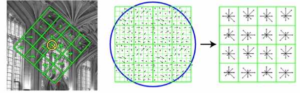
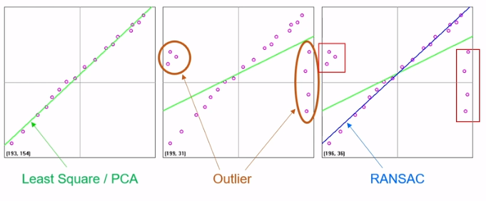

# 230501


# 크기 불변 특징과 SIFT 알고리즘

- 크기 불변 특징
- SIFT 알고리즘
- 기타 특징점 알고리즘

## 크기불변 특징

- 템플릿 매칭은 사이즈가 변화하거나 회전의 경우 매칭이 불가능함
- 따라서 크기불변 매칭 방법에 대해서 배울 것임

### 코너의 특징

- 평탄한 영역, 에지 영역에 비해 변별력이 높음
- 이동 , 회전 변환에 강인
- 크기 변환에 취약
    - 객체를 보는 스케일에 따라서 코너인지 아닌지 확인이 어렵다
        
        
        

### 크기불변 특징점

- 스케일 스페이스(scale-space) 또는 이미지 피라미드(image pyramid)를 구성하여 영상의 크기가 바뀌더라도 반복적으로 검출될 수 있는 특징점을 찾으면 매칭등의 응용에서 사용할 수 있음
- 주요 크기 불변 특징점 알고리즘 SIFT, SURF, KAZE, AKAZE, ORB 등
- 특징점(feature point) ~ 키포인트(keypoint) ~ 관심점(interest point)
- 기술자(descriptor) ~ 특징백터(feature vector)
    
    
    

## SIFT 알고리즘

- SIFT 논문 : [https://www.cs.ubc.ca/~lowe/papers/ijcv04.pdf](https://www.cs.ubc.ca/~lowe/papers/ijcv04.pdf)
    - Lowe, David G. "Distinctive image features from scale-invariant keypoints." *International journal of computer vision* 60 (2004): 91-110.
    - Scale Invariant Feature Transform  : Scale & rotation invariant, local feature detector & descriptor

### SIFT 계산단계

- Detector (이미지에서 키포인트를 검출)
    - Scale-Space extrema detection
    - Keypoint localization
- Descriptor (부분영상에서 특징벡터를 추출하는) → 회전에 불변한 특징을 뽑음
    - Orientation assignment
    - Keypoint description

**Detector**

> Scale-Space extrama detection
> 
> 1. resize & blurring → 연속된 blurring 영상에 대한 차영상 계산
>     1. 회색 → 차가 없는 부분, 검정색, 흰색 부분 차가 있는 부분 에지 같은 부분
>         
>         
>         
>     
>     
>     
> 2. Keypoint localization
>     1. (1980 : Scale-space theory) The maxima and minima of ${\sigma^2 \nabla^2 G}$( 가우시안 함수를 두번미분 ) produce the most stable image features
>         
>         
>         
>         
>         
>         → L : Laplacian , DoG 빨간색 원래는 2번 미분한 Laplacian of Gaussian을 사용해야하지만 차가우시안의 함수 그래프와 유사하기 때문에 속도면으로 더 연산이 빠른 DoG를 사용
>         
>     2. 3차원적 관점에서 scale에 차이가 있는 영상의 픽셀 주변까지 다 비교하여 지역 최솟값 또는 지역 최댓값을 선택
>         
>         
>         
>     3. 키포인트를 검출한 후 좀 더 정확한 키포인트 성분만 남기기 위해 다음을 진행 
>         1. 서브픽셀 정확도
>         2. 낮은 대비 극점 제거
>         3. 에지 성분 제거(코너가 좀 더 정확)
>         4. 결과적으로 방향불변 크기불변의 확률이 높은 키포인트를 검출
>             
>             
>             

**Descriptor**

> 3.  Orientation assignment
> 
> - 방향불변 특성을 위한 주방향 성분 추출
>     - 키포인트 근방의 부분 영상을 추출
>     - 부분영상의 모든 픽셀에서 그래디언트 성분(크기&방향)을 계산
>         - 방향성분에 대한 히스토그램 생성(360도에 대해 36개 빈)
>     - 히스토그램 최댓값 방향과 최댓값의 80% 이상 크기를 갖는 빈 방향을 키포인트 방향으로 설정
>         - 하나의 좌표에서 여러개의 키포인트 표현가능
>             
>             
>             
>             
>             
>             화살표가 길게 표현 : 작은 스페이스의 영상에서 검출, 짧은 것은 원본에 가까운 사이즈 영상에서 검출
>             
> 
> 1. Keypoint description ( feature vector)
>     1. 각 키포인트 위치에서 스케일(어떤 크기의 영상에서 추출했느냐에 따라)과 기준 방향을 고려하여 사각형 영역을 선택
>     2. 사각형 영역을 4x4 구역으로 분할하고, 각 구역에서 8 방향의 방향 성분 히스토그램을 구함
>         1. 4x4x8 = 128 차원의 벡터(float 자료형)
>             
>             
>             
>     

### 특징점 매칭 사용 예

- image 에서 특정 object 찾기
- 파노라마 이미지
- Localization


## 기타 특징점 알고리즘

- SURF(Speed-Up Robust Features)
    - SIFT를 기반으로 속도를 향상시킨 크기 불변 특징점 검출 방법
    - DOG(Derivative of Gaussian) 함수를 단순한 이진 패턴으로 근사화
    - 적분영상(integral image)를 이용하여 속도 향상
- KAZE
    - 비선형 스케일 스페이스에서 공기의 흐름
    - 가우시안 함수 대신 비선형 확산 필터(nonlinear diffusion filter)를 이용하여 특징점을 검출
    - SURF 보다 느리지만 SIFT와 비슷한 성능
- BRIEF( Binary Robust independent elementary featueres)
    - 이진 기술자를 이용한 빠른 키포인트 기술 방법(Not detector)
    - 키포인트 주변 픽셀 쌍을 미리 정하고, 픽셀 값의 크기를 비교하면 0 또는 1로 특징을 기술
        
        
        
        문자열 비교할 때도 사용하는 서로 다른 이진값이 몇개 있는지 찾는 것
        
    
    → week 한 정보를 모아서 사용하는 boosting 
    
- ORB(Oriented Fast and Rotated BRIEF)
    - FAST 방법으로 키포인트를 찾고 Harris 코너 방식으로 순위를 매김
    - 피라미드 영상에 적용하여 크기 불변성 확보
    - 키포인트의 방향 성분을 이용하여 BRIEF방법에서 픽셀 쌍의 좌표를 회전하여 특징 벡터를 추출(이진기술자)
    - SIFT, SURF보다 빠르고 SURF 성능이 좋음
- AKAZE(Accelerated KAZE)
    - 이진 기술자 사용

# OpenCV 특징점 검출과 기술

- OpenCV 특징점 클래스
- 특징점 검출 방법
- 특징점 기술자 구하기
- 특징점 알고리즘 성능 비교

## OpenCV 특징점 클래스

- Feature2D [https://docs.opencv.org/4.5.0/d0/d13/classcv_1_1Feature2D.html](https://docs.opencv.org/4.5.0/d0/d13/classcv_1_1Feature2D.html)
    
    
    
    - 특징점이나 기술자만 동작하는 것도 있음
    - pt, size, angle은 멤버 변수
- 특징점 표현을 위한 Keypoint 클래스
    
    ```cpp
    // modules\core\include\opencv2\core\Types.hpp
    class KeyPoint
    {
    public:
    		KeyPoint();
    		Keypoint(Point2f _pt, float _size, float _angle=-1, float _response=0,
    							int _octave=0, int _class_id=-1);
    		KeyPoint(float x, float y, float _size, float _angle=-1,
    						 float _response=0, int _octave=0, int _class_id=-1);
    
    		Point2f pt; // 특징점 좌표
    		float size; // 의미있는 이웃 크기(지름)
    		float angle; // 방향각도(-1 if not applicable) [0,360)
    		int octave; // 옥타브 (피라미드 단계)
    		int class_id; // 객체 클래스 id
    }
    ```
    
- 특징점 클래스 객체 함수
    
    
    
    → 스마트 포인터 사용
    

## 특징점 검출함수


- 특징점 검출함수
    
    
    
    ```cpp
    // 
    cv::Ptr<cv::Feature2D> detector = cv::SIFT::create(); // SIFT, KAZE, AKAZE, ORB
    // Feature2D 대신 SIFT, KAZE 같이 명확하게 지정해도 되고 상위개념으로 써도 됨
    std::vector<cv::KeyPoint> keypoints;
    detector->detect(src, keypoints); //input image, vector keypoints 여기다가 검출된거 다 저장해라
    
    std::cout << keypoints.size() << std::endl;
    for (int i = 0; i < keypoints.size(); i++){
    	keypoints[i].pt; // float type -> int 로 변환해서 영상에 그릴 수 있음 
    } // 이 과정을 drawKeypoints를 사용해서 가능
    ```
    
- 검출된 특징점 그리기 함수
    
    
    
    ```cpp
    cv::Mat dst;
    cv::drawKeypoints(src, keypoints, dst, Scalar::all(-1), cv::DrawMatchesFlags::DRAW_RICH_KEYPOINTS);
    ```
    

- Detector 예시
    
    ```cpp
    int main()
    {
        cv::ocl::setUseOpenCL(false); // for ORB time check
    
        cv::Mat src = imread("lenna.bmp", cv::IMREAD_GRAYSCALE);
    
        if (src.empty()) {
            std::cerr << "Image load failed!" << std::endl;
            return -1;
        }
    
        cv::TickMeter tm; // time check -> t
        tm.start(); // t
    
        cv::Ptr<cv::Feature2D> detector = cv::SIFT::create(); // SIFT, KAZE, AKAZE, ORB
    
        std::vector<cv::KeyPoint> keypoints;
        detector->detect(src, keypoints);
    
        tm.stop(); // t
        std::cout << "Elapsed time: " << tm.getTimeMilli() << "ms." << std::endl;
        std::cout << "keypoints.size(): " << keypoints.size() << std::endl;
    
        cv::Mat dst;
        cv::drawKeypoints(src, keypoints, dst, cv::Scalar::all(-1), cv::DrawMatchesFlags::DRAW_RICH_KEYPOINTS);
    
        cv::imshow("dst", dst);
        cv::waitKey();
    }
    ```
    

## 특징점 기술자 구하기

### 기술자(descriptor, feature vector)

- 각각의 특징점 근방의 부분 영상을 표현하는 실수 또는 이진 벡터
- openCV에서 Mat 객체로 표현
    - 행개수: 특징점 개수
    - 열개수: 특징점 기술자 알고리즘에 의해 정의됨(SIFT:128, KAZE,SURF:64 이런식)
        
        
        

### 실수기술자

- 주로 특징점 부근 부분 영상의 방향 히스토그램을 사용
- 보통 float 자료형을 사용하여 실수정보를 저장하는 방식
- 실수 기술자를 사용하는 알고리즘 : SIFT, SURF, KAZE 등
- 실수 기술자는 보통 **L2노름(L2 norm)을 사용하여 유사도를 판단**
    
    
    

### 이진기술자

- 이진 테스트를 이용하여 부분 영상의 특징을 기술
- 보통 uchar 자료형을 사용하여 비트단위로 영상의 특징정보를 저장
- 이진 기술자를 사용하는 알고리즘: AKAZE, ORB, BRIEF 등
- 이진 기술자는 해밍거리(Hamming distance)를 사용하여 유사도를 판단
    
    
    

- 특징점에서 기술자(특징벡터) 계산
    
    
    
- 특징점 검출 및 기술자(특징벡터) 계산 (검출, 기술을 한번에)
    
    
    
    - detectAndCompute
        
        ```cpp
        CV_WRAP virtual void detectAndCompute( InputArray image, InputArray mask,
                                                   CV_OUT std::vector<KeyPoint>& keypoints,
                                                   OutputArray descriptors,
                                                   bool useProvidedKeypoints=false );
        ```
        
    
    → 마지막 param은 검출과 기술을 함께 하고 싶으면 false
    

- descriptor 예시
    
    ```cpp
    int main()
    {
        cv::ocl::setUseOpenCL(false); // To set  opencl initialization to take place only once
    
        cv::Mat src = imread("lenna.bmp", cv::IMREAD_GRAYSCALE);
    
        if (src.empty()) {
            std::cerr << "Image load failed!" << std::endl;
            return -1;
        }
    
        cv::TickMeter tm;
        tm.start();
    
        cv::Ptr<cv::Feature2D> feature = cv::SIFT::create(); // SIFT, KAZE, AKAZE, ORB
    
        std::vector<cv::KeyPoint> keypoints;
        cv::Mat desc;
        feature->detectAndCompute(src, cv::Mat(), keypoints, desc);
    
        tm.stop();
        std::cout << "Elapsed time: " << tm.getTimeMilli() << "ms." << std::endl;
        std::cout << "keypoints.size(): " << keypoints.size() << std::endl;
        std::cout << "desc.size(): " << desc.size() << std::endl; // descriptor size : [ cols x rows ]
    
        cv::Mat dst;
        drawKeypoints(src, keypoints, dst, cv::Scalar::all(-1), cv::DrawMatchesFlags::DRAW_RICH_KEYPOINTS);
    
        imshow("dst", dst);
        cv::waitKey();
    }
    ```
    

- sift orb akaze 만 주요 깊게 사용하면 됨 opencv 에서는 ! 매칭 성능은 SIFT > AKEZE > ORB


# 특징점 매칭

- 특징점 매칭
- 좋은 매칭 선별 방법

ORB → norm_hamming (binary discriptor)

## 특징점 매칭

- 특징점 매칭을 위해 원본영상 변형
    
    ```cpp
    cv::Mat src2;
    cv::resize(src, src2, cv::Size(), 0.8, 0.8); // 결과영상을 0.8배로 만듦
    cv::Point cp(src2.cols / 2, src2.rows / 2); // 영상의 가운데 좌표를 cp로 지정
    cv::Mat rot = getRotationMatrix2D(cp, 10, 1);
    cv::warpAffine(src2, src2, rot, Size());
    ```
    
- 두 영상에서 추출한 특징점 기술자를 비교하여 유사한 기술자끼리 선택하는 작업
    - feature를 모두 비교함 아래의 경우 4x3 = 12 번의 비교연산이 필요
    
    
    
- 특징벡터 유사도 측정방법
    - 실수 특징 벡터: L2 norm 사용
    - 이진특징 벡터 : 헤밍거리(hamming distance) 사용
- 특징점 매칭 클래스
    
    
    
    → 매칭점이 엄청 많을 때 MB 이상 일때 FLANN 사용하면 좋음 
    
    - 특징점 매칭 (최선의 매칭 반환)
        
        
        
    - 상위 k개의 매칭 반환
        
        
        
- DMatch class
    
    ```cpp
    class DMatch
    {
    public:
    	DMatch();
    	DMatch(int _queryIdx, int _trainIdx, float _distance);
    	DMatch(ing _queryIdx, int _trainIdx, int _imgIdx, float _distance);
    
    	int queryIdx; // query descriptor index
    	int trainIdx; // train descriptor index
    	int imgIdx; // train image index 1:N일 경우
    	
    	float distance; // 두 특징점 사이의 거리(비유사도)
    	//less is better
    	bool operator<(const DMatch &m) const;
    }
    ```
    
    - DrawMatches
        
        
        

- 매칭 코드 작성
    
    ```cpp
    void keypoint_matching()
    {
        Mat src1 = imread(file1, IMREAD_GRAYSCALE);
        Mat src2 = imread(file2, IMREAD_GRAYSCALE);
    
        if (src1.empty() || src2.empty()) {
            cerr << "Image load failed!" << endl;
            return;
        }
    
        vector<KeyPoint> keypoints1, keypoints2;
        Mat desc1, desc2;
        feature->detectAndCompute(src1, Mat(), keypoints1, desc1);
        feature->detectAndCompute(src2, Mat(), keypoints2, desc2);
    
        Ptr<DescriptorMatcher> matcher = BFMatcher::create();
    //	Ptr<DescriptorMatcher> matcher = BFMatcher::create(NORM_HAMMING); // for binary descriptors
    
    		// 매칭 정보 생성 
        vector<DMatch> matches; 
        matcher->match(desc1, desc2, matches);
    
        Mat dst;
        drawMatches(src1, keypoints1, src2, keypoints2, matches, dst);
    
        imshow("dst", dst);
        waitKey();
        destroyAllWindows();
    }
    ```
    

## 좋은 매칭 선별 방법

1. 좋은 매칭 선별 방법 #1
    - 가장 좋은 매칭 결과에서 `float distance; // 두 특징점 사이의 거리(비유사도)` 값이 작은 것 N개를 사용
    - `DMatch::distance` 값을 기준으로 정렬 후 상위 N개 선택
    - DMatch 클래스에 크기 비교 연산자(<) 오버로딩이 distance 멤버 변수를 사용하도록 되어있음
        
        ```cpp
        /* 특징점 검출 및 기술 */
        Ptr<DescriptorMatcher> matcher = BFMatcher::create();
        
        vector<DMatch> matches;
        matcher->match(desc1, desc2, matches);
        
        std::sort(mathces.begin(), mathces.end());
        vector<DMatch> good_matches(matches.begin(), matches.begin() + 80);
        ```
        
2. 좋은 매칭 선별 방법 #2
    - knnMatch() 함수를 사용하여 두개의 매칭 결과 반환
    - 가장 좋은 매칭 결과의 distance값과 두번째로 좋은 매칭 결과의 distance 값의 비율을 계산
    - 이 비율의 임계값(e.g. 0.7) 보다 작으면 선택
        - 비율 값이 작을 수록 잘 된 매칭(closet_distance / next_closet_distance) < Th
        
        ```cpp
        /* 특징점 검출 및 기술 */
        
        vector<vector<DMatch>> matches;
        matcher->knnMatch(desc1, desc2, matches, 2);
        
        vector<DMatch> good_mathces;
        for (auto& m : matches){
        	if (m[0].distance / m[1].distance < 0.7)
        		good_matches.push_back(m[0]);
        }
        ```
        

# 호모그래피와 영상매칭

- 호모그래피
- RANSAC 알고리즘
- 호모그래피와 영상매칭

## 호모그래피

- 호모그래피(Homography)란?
    - 두 평면 사이의 투시변환(Perspective transform)
    - 8dof : 최소 4개의 대응점 좌표가 필요
        
        
        
- 호모그래피 응용 : all around view(bird eye view)
- 호모그래피 행렬 구하기( getperspectivetransform 과 비슷하지만 그 함수는 input, output 점이 정확히 4개일 경우 / findHomography는 4개 이상일 경우)
    
    
    
    - method : 최소자승법은 잘못 매칭된 결과가 없을 경우 사용, 있다면 LMEDS, RANSAC, RHO 사용( outlier 갯수가 전체의 50% 이상일 경우 RANSAC, RHO 사용)

## RANSAC 알고리즘

- RANdom SAmple Consensus
- 이상치(outller)가 많은 원본 데이터로부터 모델 파라미터를 예측하는 방법
    
    
    
    - Line fitting by RANSAC
        - 임의의 두점을 찾아 직선을 그린다
        - 나머지 점들과 직선 사이의 거리를 계산(거리 ~ 에러)
        - 에러가 허용 오차 안쪽에 있는 점들의 개수를 구함 (N=3)
            
            
            

## 호모그래피와 영상매칭

```cpp
void find_homography()
{
    Mat src1 = imread(file1, IMREAD_GRAYSCALE);
    Mat src2 = imread(file2, IMREAD_GRAYSCALE);

    if (src1.empty() || src2.empty()) {
        cerr << "Image load failed!" << endl;
        return;
    }

    TickMeter tm;
    tm.start();

    vector<KeyPoint> keypoints1, keypoints2;
    Mat desc1, desc2;
    feature->detectAndCompute(src1, Mat(), keypoints1, desc1);
    feature->detectAndCompute(src2, Mat(), keypoints2, desc2);

    Ptr<DescriptorMatcher> matcher = BFMatcher::create();

#if 1
    vector<DMatch> matches;
    matcher->match(desc1, desc2, matches);

    std::sort(matches.begin(), matches.end());
    vector<DMatch> good_matches(matches.begin(), matches.begin() + 80);
#else
    vector<vector<DMatch>> matches;
	matcher->knnMatch(desc1, desc2, matches, 2);

	vector<DMatch> good_matches;
	for (const auto& m : matches) {
		if (m[0].distance / m[1].distance < 0.7)
			good_matches.push_back(m[0]);
	}
#endif

    vector<Point2f> pts1, pts2;
    for (size_t i = 0; i < good_matches.size(); i++) {
        pts1.push_back(keypoints1[good_matches[i].queryIdx].pt);
        pts2.push_back(keypoints2[good_matches[i].trainIdx].pt);
    }

    Mat H = findHomography(pts1, pts2, RANSAC);

    tm.stop();
    cout << "time: " << tm.getTimeMilli() << endl;

    Mat dst;
    drawMatches(src1, keypoints1, src2, keypoints2, good_matches, dst,
                Scalar::all(-1), Scalar::all(-1), vector<char>(),
                DrawMatchesFlags::NOT_DRAW_SINGLE_POINTS);

    vector<Point2f> corners1, corners2;
    corners1.push_back(Point2f(0, 0));
    corners1.push_back(Point2f(src1.cols - 1.f, 0));
    corners1.push_back(Point2f(src1.cols - 1.f, src1.rows - 1.f));
    corners1.push_back(Point2f(0, src1.rows - 1.f));
    perspectiveTransform(corners1, corners2, H);

    vector<Point> corners_dst;
    for (Point2f pt : corners2) {
        corners_dst.push_back(Point(cvRound(pt.x + src1.cols), cvRound(pt.y)));
    }

    polylines(dst, corners_dst, true, Scalar(0, 255, 0), 2, LINE_AA);

    imshow("dst", dst);
    waitKey();
    destroyAllWindows();
}
```