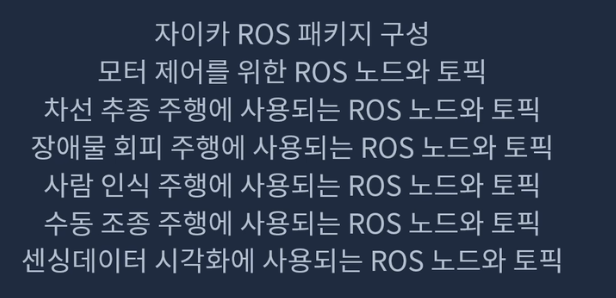

# xycar 정리


[자이카 사용 매뉴얼(new ver)](https://www.notion.so/new-ver-5158f3c513124e3298174312d2ec7290) 

# xycar_ros pkg




## 자이카 조이스틱


## ROS 사용 요약

### ROS 명령어

| 명령어 | 설명 |
| --- | --- |
| $ rosrun [pkg] [topic] | 노드 실행 |
| $ rosnode list | 노드 이름 탐색 |
| $ rostopic list | 토픽 이름 탐색 |
| $ rostopic type [topic] | 토픽의 자료형 탐색 |
| $ rostopic echo [topic] | 발행되는 토픽 들여다보기 |
| $ rosmsg show [msg] | 자료형의 구조 탐색 |

### .bashrc 에 추가

```
alias cm='cd ~/xycar_ws && catkin_make'
source /opt/ros/melodic/setup.bash
source ~/xycar_ws/devel/setup.bash
export ROS_MASTER_URI=http://localhost:11311
export ROS_HOSTNAME=localhost
```

### launch 사용법

| 명령어 | 설명 |
| --- | --- |
| $ roslaunch [pkg] [file.launch] | 런치파일 실행 (roscore 실행이 안 되어있어도 가능) |
| <include file="$(find [같이 실행할 런치파일의 pkg])/src/launch/[같이 실행할 런치파일 이름].launch/> | 다른 런치파일을 불러올 때 사용하는 태그 |
| <param name="변수이름" type="변수 자료형" value="변수값"/> | 파라미터 태그 |

## 사용자 메세지 만들기

## 메세지 파일 생성하기

```python
mkdir -p msg
cd ~/msg
gedit ~~.msg
```

## pakage.xml 수정하기

파일 아래쪽에 내용추가

```xml
<build_depend>message_generation</build_depend>
<exec_depend>message_runtime</exec_depend>
```

## CMakeLists.txt 수정

```
find_pakage(catkin REQUIRED COMPONENTS
	message_generation # 추가하기
)
add_message_files(
	FILES
	my_msg.msg # 코멘트 풀고 1줄 새롭게 추가
)
generate_messages(
	DEPENDENCIES # 코멘트 풀기
)
catkin_package(
	CATKIN_DEPENDS message_runtime # 1줄 추가
	# INCLUDE_DIRS include
	# LIBRARIES my_package
	# CATKIN_DEPENDS rospy std_msgs
	# DEPENDS system_lib
)
```

---

# [자이카 하드웨어](https://www.notion.so/230330-91c8be3db5af4d958ce1d3a61c3a6cbd)


## [전원 키는 방법](https://www.notion.so/230331-f1ea345b6ef94a72af6118390821db2b)

1. 메인 배터리 전원 켜기
2. 파란색  :  모터 전원 버튼 켜기
3. 빨간색  : 메인 전원 버튼 켜기
4. 노란색  : 프로세서 보드 파워 ON
5. 와이파이에 자이카가 잡히면 부팅 성공
    1. 휴대폰 or 모니터 연결로 확인

## 배터리

### 메인 배터리

- 전원 버튼을 눌러야 전기가 나옴
- 누를 때마다 전압 설정이 바뀜 (19V로 맞추어야 한다)

### 모터 배터리 충전법

- 충전기잭을 꽃는다.
- 첫번째 'Batt. Type'버튼을 여러번 눌러 'NiMH BATT'를 선택 후 4번 째 'start'버튼을 누른다.
- 'start'버튼을 누르면 숫자 부분이 깜빡인다. 'Dec, Inc'버튼을 눌러 숫자가 1.5A가 되게 한다.
- 'Start/Enter' 버튼을 눌러 세팅을 종료한다.
- 'Start/Enter'버튼을 2초 이상 누르면 삑 소리와 함께 충전이 시작된다.

## 원격 연결

- 자이카 리눅스 로그인 아이디/패스워드: nvidia/nvidia
- 자이카 와이파이 패스워드: xycar123
- 먼저 와이파이로 자이카와 연결

### SSH CUI 연결법

1. `$ssh -Y nvidia@10.42.0.1` 비밀번호(nvidia)로 접속

## Sensor spec

| 장비 | 설명 | 해상도 | 프레임 |
| --- | --- | --- | --- |
| 카메라 | 170도 어안렌즈, CMOS 센서 | 640x480, 1920x1080 | 120 fps, 30 fps |
| IMU | 가속도(xyz), 자이로(RPY)
지자계(N-S), R (z->y), R (z->x), Y (x->y) | - | - |
| 라이다 | 0.504˚, 5000 sampling
12cm ~ 12 m | - | - |
| 초음파 센서 | Min/Max = 2 cm/4 m 
measuring angle = 15˚ | - | - |
| Depth 카메라 | 적외선 카메라, RGB 카메라 | 1280x720, 1920x1080 | 최대 90fps, 30 fps |

### 초음파

- 시그널
    - vcc : 센서 부품에 전력 공급 (DC 5v)
    - GND : 회로의 그라운드에 연결
    - Trig : 센서를 동작시키기 위한 트리거 시그널(입력)
    - Echo : 거리측정 결과를 전달하기 위한 시그널(출력)
    
    
    


초음파 센서 배열 순서


- 시작 → 초음파 발사와 수신 → 시간차 출력
    - 아두이노가 TRIG 핀에 10us 동안 High 신호를 내보냄
    - 초음파센서가 40kHz 초음파 펄스(pulse)를 여덟개 만들어 물체로 보냄
    - 물체에 반사된 초음파 펄스가 되돌아가서 초음파센서에 수신됨
    - 센서는 송신과 수신의 시간차에 비례하는 길이의 펄스를 Echo 핀으로 출력함
    
    
    
- 초음파 센서를 이용한 거리 측정방법
    - 소리 속도 : 340m/s (1s 당 340m 이동)
    - 1cm 이동하는데 약 20us 소요
    - 송신과 수신의 시간차 = 초음파의 왕복 이동시간
    - 물체까지의 거리  = ((송신과 수신의 시간차 us / 2) / 29us) cm


- 초음파 센서의 측정 오류 ( 흡수,,, 튕기거나)

# 자이카 소프트웨어

### 초음파

1. 초음파 센서 하드웨어 이해하기
    - 초음파 센서란
        
        ### 초음파센서
        
        - Ultrasonic Wave 초음파란? : 가청주파수 대역보다 높은 진동수로 발생하는 파동 ( 가청주파수인 20Hz ~ 20kHz 이상 )
        - 초음파를 이용하여 센서로부터 사물까지의 직선거리를 측정
            
            
            
        - 시그널
            - vcc : 센서 부품에 전력 공급 (DC 5v)
            - GND : 회로의 그라운드에 연결
            - Trig : 센서를 동작시키기 위한 트리거 시그널(입력)
            - Echo : 거리측정 결과를 전달하기 위한 시그널(출력)
        
        
        
        - 시작 → 초음파 발사와 수신 → 시간차 출력
            - 아두이노가 TRIG 핀에 10us 동안 High 신호를 내보냄
            - 초음파센서가 40kHz 초음파 펄스(pulse)를 여덟개 만들어 물체로 보냄
            - 물체에 반사된 초음파 펄스가 되돌아가서 초음파센서에 수신됨
            - 센서는 송신과 수신의 시간차에 비례하는 길이의 펄스를 Echo 핀으로 출력함
            
            
            
        - 초음파 센서를 이용한 거리 측정방법
            - 소리 속도 : 340m/s (1s 당 340m 이동)
            - 1cm 이동하는데 약 20us 소요
            - 송신과 수신의 시간차 = 초음파의 왕복 이동시간
            - 물체까지의 거리  = ((송신과 수신의 시간차 us / 2) / 29us) cm
        
        
        
        - 초음파 센서의 측정 오류 ( 흡수,,, 튕기거나)
2. 아두이노 역할 이해
    - 아두이노초음파 연결
        
        초음파 센서가 보내주는 펄스 신호를 받아 분석함
        
        초음파를 쏜 시점과 반사판을 받은 시점의 시간차이를 이용해서 물체까지의 거리를 계산하고 이를 ros에게 알려줌
        
        초음파센서와 아두이노의 연결
        
        Trig - 아두이노가 초음파센서에게 보내는 신호
        
        Echo - 초음파 센서가 아두이노에게 보내는 신호
        
        
        
        
        
    - 아두이노 펌웨어 프로그래밍
        
        아두이노 HC-SR04 초음파 센서 검색하기 펌웨어 제작해서 아두이노에 넣어야함!
        
        PC에서 작업 후 초음파 센서로 집어넣어야함 
        
        1. [https://www.arduino.cc/en/software](https://www.arduino.cc/en/software) 소프트웨어 다운로드
        2. ultrasonic_1_fw.ino 파일 작성 
    - 아두이노 코드 ultrasonic_1_fw
        
        ```jsx
        /*
        HC-SR04 초음파 센서
        */
        
        #define trig 2  // 트리거 핀 선언
        #define echo 3  // 에코 핀 선언
        
        void setup()
        {
          Serial.begin(9600);     // 통신속도 9600bps로 시리얼 통신 시작
          // Serial.println("Start... Ultrasonic Sensor");
          pinMode(trig, OUTPUT);  // 트리거 핀을 출력으로 선언
          pinMode(echo, INPUT);   // 에코핀을 입력으로 선언
        }
        
        void loop() { 
          long duration, distance;  // 거리 측정을 위한 변수 선언
          // 트리거 핀으로 10us 동안 펄스 출력
          digitalWrite(trig, LOW);  // Trig 핀 Low
          delayMicroseconds(2);     // 2us 딜레이
          digitalWrite(trig, HIGH); // Trig 핀 High
          delayMicroseconds(10);    // 10us 딜레이
          digitalWrite(trig, LOW);  // Trig 핀 Low
        
          // pulseln() 함수는 핀에서 펄스신호를 읽어서 마이크로초 단위로 반환
          duration = pulseIn(echo, HIGH);
          distance = duration * 170 / 1000; // 왕복시간이므로 340m를 2로 나누어 170 곱하
          Serial.print("Distance(mm): ");
          Serial.println(distance); // 거리를 시리얼 모니터에 출력
          delay(100);
        }
        ```
        
        
        
    - PC에서 아두이노 연결 & 컴파일
        
        ```python
        $ lsusb 
        HL-340 USB-Serial ~~~~ 나오면 연결 됨 
        ```
        
        USB 케이블 연결
        
        - 아두이노와 PC(또는 Nvidia 보드)는 물리적으로 USB 케이블로 연결
            - 내부적으로 Serial 통신임 (Serial over USB)
        
        컴파일& 업로드
        
        
        
        출력값확인
        
        
        
3. 리눅스 프로그래밍 필요
    
    리눅스 ROS : 아두이노가 보내주는 물체까지의 거리 정보를 사용하기 좋은 형태로 가공
    
    ROS 토픽에 담아 그게 필요한 노드들에게 Publish 함
    
    ```python
    # 폴더 구성
    ultrasonic
    ├── launch
    |   └── ultra.launch
    └──src
        ├── ultrasonic_pub.py
        └── ultrasonic_sub.py
    
    ```
    
- python (ultrasonic_pub.py) - 초음파센서가 보낸 거리정보를 토픽에 담아 pub
    
    ```python
    #!/usr/bin/env python
    
    import serial, time, rospy, re
    from std_msgs.msg import Int32
    
    ser_front = serial.Serial(
        port='/dev/ttyUSB0', # 아두이노 연결 포트
        baudrate=9600, # 아두이노에서 선언한 통신 속도
        )
    
    def read_sensor():
        serial_data = ser_front.readline() # 시리얼 포트로 들어온 데이터를 받아옴
        ser_front.flushInput() # 중간에 버퍼들이 있음 삭제해주는 flush
        ser_front.flushOutput() 
        ultrasonic_data = int(filter(str.isdigit, serial_data)) # string -> int
        msg.data = ultrasonic_data
      
    if __name__ == '__main__':
    
        rospy.init_node('ultrasonic_pub', anonymous=False) # initialize node
        pub = rospy.Publisher('ultrasonic', Int32, queue_size=1)
    
        msg = Int32() # message type
        while not rospy.is_shutdown():
            read_sensor()  # serial port sensor가 보내준 문자열 읽어서 거리 정보 추출
            pub.publish(msg) # publish a message
            time.sleep(0.2) 
        
        ser_front.close() # 끝나면 시리얼 포트 닫기
    ```
    
- 검증용 sub (ultrasonic_sub.py)
    
    ```python
    #!/usr/bin/env python
    
    import rospy
    from std_msgs.msg import Int32
    
    def callback(msg):
        print(msg.data)
    
    rospy.init_node('ultrasonic_sub')
    sub = rospy.Subscriber('ultrasonic', Int32, callback)
    
    rospy.spin()
    ```
    
- 실행 launch
    
    ```xml
    <!-- ultra.launch -->
    <launch>
        <node pkg="ultrasonic" type="ultrasonic_pub.py" name="ultrasonic_pub"/>
        <node pkg="ultrasonic" type="ultrasonic_sub.py" name="ultrasonic_sub" output="screen"/>
    </launch>
    ```
    
- 실행
    
    ```xml
    $ roslaunch ultrasonic ultra.launch
    ```
    

---

# 자이카 노드/ 토픽

|  | 노드명 | 토픽 | 자료형 |
| --- | --- | --- | --- |
| 모터 제어기 | /xycar_motor | /xycar_motor | xycar_motor.msg |
| 라이다 | /xycar_lidar | /scan | sensor_msgs/LaserScan |
| 카메라 | /usb_cam | /usb_cam/image_raw | sensor_msgs/Image |
| 초음파 센서 | /xycar_ultrasonic | /xycar_ultrasonic | std_msgs/Int32MultiArray |
| IMU 센서 | /xycar_imu | /imu | sensor_msgs/Imu |
| Depth cam | /camera/realsense2_camera | /camera/color/image_raw*/image_rect_raw |  |


## 메세지 타입

### Odometry


### 센서 메세지 타입

모터 제어기

```
std_msgs/Header header
	uint32 seq
	time stamp
	string frame_id
int32 angle # -50 ~ 50 (-20˚ ~ 20˚)
int32 speed # -50 ~ 50
```

카메라

```
std_msgs/Header header
	uint32 seq
	time stamp
	string frame_id
uint32 height
uint32 width
string encoding
uint8 is_bigendian
uint32 step
uint32[] data # 실제 영상 데이터
```

IMU 센서

```
std_msgs/Header header
	uint32 seq
	time stamp
	string frame_id
geometry_msgs/Quaternion orientation	#RPY에 대한 데이터
	float64 x
	float64 y
	float64 z
	float64 w
float64[9] orientation_covariance
geometry_msgs/Vector3 angular_velocity	#각속도에 대한 데이터
	float64 x
	float64 y
	float64 z
float64[9] angular_velocity_covariance
geometry_msgs/Vector3 linear_velocity	#선속도에 대한 데이터
	float64 x
	float64 y
	float64 z
float64[9] linear_acceleration_covariance
```

LiDAR 센서

```
std_msgs/Header header
	uint32 seq
	time stamp
	string frame_id
float32 angle_min
float32 angle_max
float32 angle_increment
float32 time_increment
float32 scan_time
float32 range_min
float32 range_max
float32[] ranges		# 거리정보
float32[] intensities	# 물체의 강도
```

초음파 센서

```
std_msgs/MultiArrayLayout layout
	std_msgs/MultiArrayDimension[] dim
	    string label
		uint32 size
		uint32 stride
	uint32 data_offset
int32[] data			# 초음파 데이터
```

Depth 카메라

```
# sensor_msgs/Image
std_msgs/Header header
	uint32 seq
	time stamp
	string frame_id
uint32 height
uint32 width
string encoding
uint8 is_bigendian
uint32 step
uint32[] data # 실제 영상 데이터
```

- 초음파 센서와 아두이노 연결
    
    
